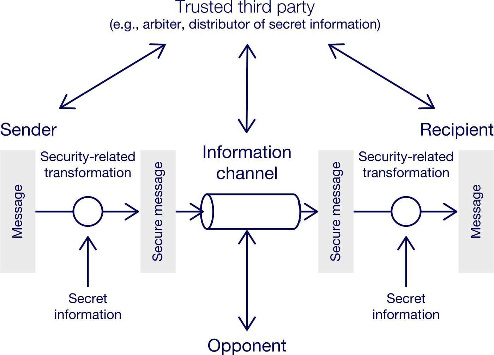
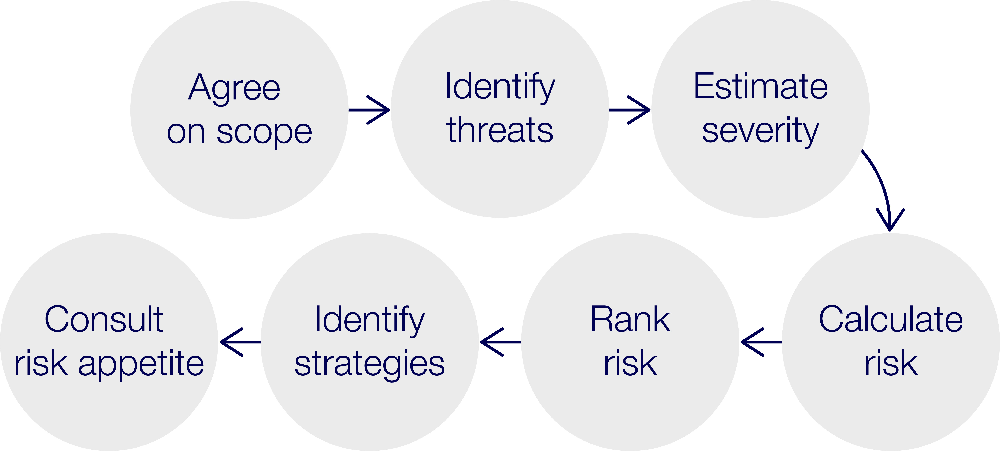

# INTE2665 | Week 2: Design Principles for the Cyber Security Environment

## 2.0.0 Week overview: Design principles for the cyber security environment

## Welcome to Week 2 of Introduction to Cyber Security

This week you’ll learn about how cyber security practitioners design security solutions to reduce 
cyber risks to information systems. You’ll explore how security design principles are used to devise 
cyber security solutions for a given attack surface area. You’ll look at how attack trees can be 
used to determine the characteristics of security vulnerabilities and how the severity of the 
vulnerabilities can determine the level of the risk to information systems. This will continue to 
form your foundational knowledge in cyber security.

To develop your computer skills, you’ll continue to practise basic commands on Kali Linux to prepare 
for Assessment 1 and Assessment 2.


## What you’ll learn this week

- Explain security design principles
- Describe the differences and similarities between an attack surface and an attack tree
- Evaluate and use a risk metric to determine the level of risk
- Use basic Kali Linux commands.


## Week 2 activities

- Read about security design principles for the cyber security environment
- Apply design principles to a real-life scenario
- Create an attack tree
- Compare attack surfaces and attack trees
- Analyse a scenario and determine the level of risk involved
- Practise using basic Kali Linux commands.


### 2.1.0 Activity: Exploring security design principles

In this activity you’ll explore security design principles and check your understanding before applying 
your knowledge to a real-life scenario. Security design principles are developed based on industry 
experiences. Following design principles can result in the development of trustworthy information 
systems. This is essential knowledge for any cyber security professional.


#### 2.1.1 Explore security design principles

##### What are security design principles?

In this task you’ll read about security design principles. This will provide the context for the 
remaining tasks in this activity and will continue to build your foundational understanding of security 
design.

Security design principles are best practices to follow to develop protection mechanisms against flaws. 
Some of these principles are:

- Open design
- Separation of privilege
- Least privilege
- Encapsulation
- Modularity

Read - The following reading will help you learn about more security design principles.

>> Read Chapter 1 pages 32-36 from chapter-01_introduction.txt

As you read, consider the following:

- Which of these design principles are familiar to you? Which are new?
- Which security design principles are most important? Why?


#### 2.1.2 Identifying security principles

##### Checking your understanding

In this task you’ll complete a short activity to check your understanding of the 13 security design 
principles discussed in the reading. You’ll apply this knowledge in Task 2.1.3.

Check your understanding
Complete the task below to check your understanding of the security design principles. Review Task 
2.1.1 if needed.

Read the descriptions of the 13 security design principles. Type in the name of each relevant principle
in the text box below.

1. Any security measures implemented should be simple and small => **Economy of mechanism**
2. Access should be based on authorisation and the default is to deny access. => **Fail-safe defaults**
3. Access must always be checked through the access control mechanism. => **Complete mediation**
4. The design of the security mechanism should be open to public viewing. => **Open design**
5. There must be multiple conditions for a user to achieve access to a system. => **Separation of privilege**
6. Users should only be granted the lowest access needed to perform a task. => **Least privilege**
7. The design of a system should limit the overlapping of functions. => **Least common mechanism**
8. Security mechanisms should be difficult to use. => **Psychological acceptability**
9. Systems with critical data must restrict public access. / Files of individual users should be separated from each other. / Security mechanisms must prevent unwanted access. => **Isolation**
10. The process of a protected system and the data points are enclosed together and the process must be called from a domain entry point. => **Encapsulation**
11. A security mechanism must be created as individual protected modules and the security mechanism is created using modular architecture. => **Modularity**
12. Multiple overlapping security approaches should be used. => **Layering**
13. A program or user interface should behave in a predictable way. => **Least astonishment**


#### 2.1.3 Apply design principles

##### Relating design principles to a scenario

In Task 2.1.2 you reviewed the 13 security design principles discussed by Stallings (2017). In this 
task you’ll apply these design principles to a real-life scenario. This will help you relate theory 
to working life in the cyber security field.

Discuss - Imagine this scenario:

You are tasked with setting up an experimental cyber security lab for a defence sub-contractor with 
80 employees. They specialise in researching, designing and manufacturing sensors for air navigation 
on 6th generation aircraft.

Consider the design principles from Task 2.1.2.

- Economy of mechanism
- Fail-safe defaults
- Complete mediation
- Open design
- Separation of privilege
- Least privilege
- Least common mechanism
- Psychological acceptability
- Isolation
- Encapsulation
- Modularity
- Layering
- Least astonishment.

Choose two to three design principles that might apply and justify your answers.


### 2.2.0 Activity: Examining cyber-attack surfaces and attack trees

In this activity you’ll read about cyber-attack surfaces and attack trees, and will practise creating 
an attack tree. You’ll also reflect on the differences and similarities between attack surfaces and 
attack trees.

This is a key skill in cyber security. Skills in constructing attack trees can also be applied to broader 
interconnected information and operational systems to determine any dependency-linked cyber vulnerabilities.


#### 2.2.1 Examine cyber-attack surfaces and attack trees

##### What are cyber-attack surfaces and attack trees? (ASSESSMENT-3)

In this task you’ll read about cyber-attack surfaces and attack trees. You’ll apply this knowledge in 
Task 2.2.2 and Task 2.2.3. Your understanding of this information will be tested as part of your 
**EXAM IN ASSESSMENT 3**.

Risk assessment is a key component of cyber security. There are many security risk evaluation tools 
available to assess risk including attack surfaces and attack trees. These two concepts are interlinked. 
Attack surfaces are the different points vulnerable to an attacker and attack trees are one tool that 
can be used to determine the attack paths and the level of risk to the system.

Read - about cyber-attack surfaces and attack trees.

> Read Chapter 1 pages 36-39 from chapter-01_introduction.txt

After reading, consider the following:

**What features can help lower security risks?**

Features that can help lower security risks:

- Attack surface reduction: Reduce the number of reachable vulnerabilities so attackers have fewer 
  entry points.
- Layering / defense in depth: Use multiple overlapping security controls rather than relying on a 
  single barrier.
- Stronger security around vulnerable points: Focus protection on exposed ports, services, interfaces, 
  and systems that process incoming data.
- Priority-based testing and hardening: Use attack surface analysis to identify the most exposed areas 
  and test or strengthen those first.
- Human-focused protections: Reduce staff vulnerability to social engineering through better procedures, 
  awareness, and access control.

_Attack risks can be lowered by reducing the attack surface, applying defense in depth, hardening 
exposed systems and interfaces, prioritising security testing on vulnerable areas, and reducing human 
weaknesses such as social engineering exposure.

**What are the differences between a network attack surface, a software attack surface and a human attack surface?**

- **Network attack surface**
This is about vulnerabilities exposed through the enterprise network, WAN, or Internet. It includes 
protocol weaknesses, denial-of-service opportunities, communication link disruption, and intruder attacks.

- **Software attack surface**
This is about vulnerabilities in code, including application software, utilities, operating systems, 
and especially web server software. The focus is on flaws in programs that attackers can exploit.

- **Human attack surface**
This is about vulnerabilities caused by people rather than technology alone. It includes social 
engineering, human mistakes, and abuse by trusted insiders.

A comparison:

- **Network attack surface**: exposed connections and network-facing services
- **Software attack surface**: exploitable flaws in code and applications
- **Human attack surface**: exploitable behaviour, trust, or error in people


_Features that lower security risk include reducing the attack surface, using layering or defense in depth, 
hardening exposed services and interfaces, and prioritising testing and security controls around the 
most vulnerable points. The network attack surface involves vulnerabilities reachable over networks 
such as protocol weaknesses and DoS attacks. The software attack surface involves flaws in applications, 
operating systems, and web server code. The human attack surface involves people-based weaknesses 
such as social engineering, human error, and insider threats._


#### 2.2.2 Create an attack tree

##### Designing an attack tree for a scenario

In Task 2.2.1 you read about attack trees. In this task you’ll design an attack tree in response to a 
real-life scenario. This will demonstrate your understanding of attack trees.


##### Create - Read the scenario below.

Develop an attack tree for a scenario in which the root node represents the disclosure of proprietary 
secrets. Follow these rules:

- Include physical, social engineering and technical attacks.
- The tree may contain both AND and OR nodes.
- The tree should have at least 15 leaf nodes.


##### Scenario example

_Consider a company whose operations are housed in two buildings on the same property; one building is 
the headquarters, the other contains the network and computer services. The property is physically 
protected by a fence installed around the perimeter. The only entrance to the property is through the 
fenced perimeter. In addition to the perimeter fence, physical security consists of a guarded front 
gate. The local networks are split between the headquarters’ LAN and the network services’ LAN. Internet 
users connect to the web server through a firewall. Dial-up users get access to a particular server 
on the network services’ LAN._

**Answer:** For the scenario above, the attack tree for the disclosure of proprietary secrets

```answer
We present the tree in text form. Call the company X:
Survivability compromise: disclosure of X proprietary secrets

OR

1. Physically scavenge discarded items from X

  OR

  1. Inspect dumpster content on-site
  2. Inspect refuse after removal from site

2. Monitor emanations from X machines

  AND

  1. Survey physical perimeter to determine optimal monitoring position
  2. Acquire necessary monitoring equipment
  3. Setup monitoring site
  4. Monitor emanations from site

3. Recruit help of trusted X insider
  
  OR

  1. Plant spy as trusted insider
  2. Use existing trusted insider

4. Physically access X networks or machines
  
  OR

  1. Get physical, on-site access to intranet
  2. Get physical access to external machines

5. Attack X intranet using its connections with internet

  OR

  1. Monitor communications over internet for leakage
  2. Get trusted process to send sensitive information to attacker over internet
  3. Gain privileged access to web server

6. Attack X intranet using its connections with public telephone network (PTN)

  OR

  1. Monitor communications over PTN for leakage of sensitive information
  2. Gain privileged access to machines on intranet connected via internet
```
*Adapted from Network security essentials: applications and standards (Stallings 2017), pages 43-44*


#### 2.2.3 Compare attack surfaces and attack trees

##### Discussing attack surfaces and attack trees

In this task you’ll compare attack surfaces and attack trees and reflect on their similarities and 
differences. This will help consolidate your understanding of these key aspects of cyber security.

Discuss

In Task 2.2.1, you read about attack surfaces and attack trees. Then in Task 2.2.2, you designed 
an attack tree.

Consider your understanding of attack trees and attack surfaces.

- How are they similar? How are they different?
- Support your ideas with evidence.
- Comment on how the similarities and differences might affect your work as a cyber security 
  professional.


### 2.3.0 Activity: Exploring the model of network security and risk-based security

In this activity you’ll read about a model for network security and analyse and discuss the model. 
You’ll then use a risk metric to analyse a scenario and determine the level of risk involved.

Understanding risk analysis in cyber security will help you to provide risk-based security solutions.


#### 2.3.1 Explore network security

##### What models are there for network security?

In this task you’ll read about a model for network security. You’ll apply this knowledge in Task 
2.3.2.

Good network design can provide extra layers of security to cyber assets. Network nodes such as 
routers need to have good protection, while information systems need to be protected by firewalls.

Read - The following reading will help you learn more about the model of network security.

> Read Chapter 1 pages 39-42 from chapter-01_introduction.txt

As you read, consider the following:

- What are the main types of threats to a security system?
- What are the main tasks in designing a security system?


#### 2.3.2 Analyse the model

##### Discussing the network security model

In this task you’ll analyse and discuss the model for network security. This model demonstrates the 
key security mechanisms and security services discussed in this course.

Discuss - Examine the model for network security below. Consider the following:

- Where would the message be clear?
- Where is the message encrypted?
- Where is an attack most likely to be successful? Explain.




#### 2.3.3 Analyse the risk level

##### Assessing the risk level in a scenario

In this task you’ll use a risk metric to analyse a scenario and determine the level of risk involved. 
This will help you learn about risk metrics as a tool to analyse the risk profile of any system, a 
key skill used in the industry.

In cyber security, risk can be defined as the impact that an adverse event can have on a system. All 
systems will have some risk; how much risk is tolerated depends on the ‘risk appetite’ of the company. 
Companies keep a risk register that lists the top risks, ranked in order of impact. This is a dynamic 
document and is regularly updated.

Risk analysts need to estimate the likelihood and severity of risk accurately to decide on the most 
effective strategies to reduce the risk in line with the company’s appetite. To do this, they follow 
a process that may include multiple steps for identifying and calculating risk.



1. Agree on Scope => Agree on the scope of the risk for a given system.
2. Identify Threats => Identify the cyber threats to the system.
3. Estimate Severity => Estimate the severity and likelihood of the risk.
4. Calculate Risk => Calculate the risk impact using a metric.
5. Rank Risk => Rank the risk based on the calculated impact and update the risk register.
6. Identify Strategies => Identify mitigation strategies and the cost for the risk.
7. Consult Risk Appetite => Consult the organisation’s risk appetite for accepting residual risks.


##### Solve the problem

Imagine you are a risk analyst. You’ll use a metric to determine the level of risk for a system 
and make recommendations to the company.

Read the scenario below.

Use the metric below to determine the level of risk to the company. Consider:

- The likelihood of the risk happening
- The severity of the risk
- Whether it would be a low, moderate, medium or high risk


#### Scenario example

A clean electric company generates electricity and distributes it to regional and remote communities. 
The communities use the electricity to support their local manufacturing systems. The clean electricity 
company’s billing system uses a Windows 7 operating system that has not been updated since its deployment.

**Metric to use**

|Likelihood Severity| 20%     | 40%     | 60%      | 80%    | 100%  |
|-------------------|---------|---------|----------|--------|-------|
| 1                 | Low     | Low     | Moderate | Medium | High  |
| 2                 | Low     | Low     | Moderate | Medium | High  |
| 3                 | Moderate| Moderate| Moderate | Medium | High  |
| 4                 | Medium  | Medium  | Medium   | Medium | High  |
| 5                 | High    | High    | High     | High   | High  |


**Answer**

The risk to the company is high.  The **likelihood of a cyber attack is high** because the Windows 7 
operating system has not been updated since its deployment, which means it may have unpatched 
vulnerabilities that can be exploited by attackers. 

The **severity of the risk is also high** because if the billing system is compromised, it could lead
to financial losses, disruption of services, and damage to the company’s reputation. Therefore, 
based on the metric, this scenario would be classified as a **high risk**.

---

END OF WEEK 2 MODULE => MOVE ON TO LAB WORKSHOP WEEKS 1-2