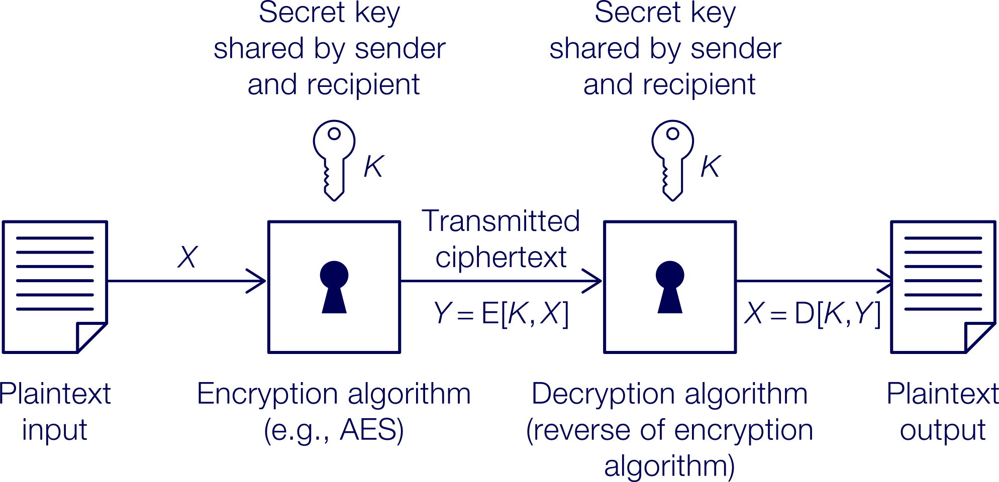

# INTE2665 - Week 03 - Cryptography Concepts (Part 1)

## 3.0.0 Week overview: Cryptography concepts – part 1

Approx. 6 hours 15 minutes to complete all tasks in this week

## Welcome to Week 3 of Introduction to Cyber Security

This week you’ll start looking at cryptography and encryption. You’ll focus on symmetric encryption,
which uses only one encryption key to encrypt and decrypt information, so the security of the key
is especially important. This type of encryption mechanism is vital for securing applications and
communications. The content of this week along with Week 4, which is on asymmetric encryption, will
support your work in Assessment 1.

To develop your computer skills, you’ll begin working with GNU Privacy Guard (GPG). This is a tool
for secure communication. You’ll be assessed on how to use it in Assessment 1.

## What you’ll learn this week

- Explain symmetric encryption principles
- Describe the parameters of a symmetric block cipher
- Explain Advanced Encryption Standard (AES)
- Encrypt and decrypt a file using GPG.

## Week 3 activities

This week you’ll:

- Read about symmetric encryption principles and advanced encryption standards
- Decrypt and encrypt a message using symmetric encryption
- Watch a video of a cyber security expert discussing AES and consider why it’s the ‘standard’
- Solve a problem about AES and discuss the results
- Practise encrypting/decrypting files using GPG.

## 3.1.0 Activity: Investigating symmetric encryption principles

Approx. 1 hour 55 minutes to complete all tasks in this activity

In this activity you’ll read about symmetric encryption principles and discuss issues around 
security. The idea of confidentiality is a key concept in cyber security, and symmetric encryption 
is a widely used method of confidential information transmission. The content in this activity will
support Assessment 1.

### 3.1.1 Explore symmetric encryption principles

Approx. 40 minutes to complete this task

#### What are symmetric encryption principles?

In this task you’ll read about symmetric encryption principles. This will provide the context for 
this activity and for Assessment 1.

Symmetric encryption principles guide the development of secure encryption algorithms and operations. 
In symmetric encryption, it’s essential that the algorithm is strong. Even if an opponent knows the 
algorithm and has access to the cipher text, they still shouldn’t be able to extract plaintext. This
can be possible if the encryption key has been securely delivered to the communicating parties.



#### Read - The following about symmetric encryption principles.

> Read Chapter-2: Symmetric Encryption and Message Confidentiality: pages 46-52

As you read, consider the following:

**Q: What are the key requirements for symmetric encryption?**

Two key requirements for symmetric encryption are:

1. A strong encryption algorithm is required. Even if an attacker knows the algorithm and has access to 
ciphertext, they should not be able to recover the plaintext or determine the key. The stronger form 
given in the text is that this should still hold even when the attacker has some plaintext-ciphertext 
pairs.

2. The secret key must be shared securely and kept secret by both sender and receiver. The chapter is 
explicit that the security of symmetric encryption depends on the secrecy of the key, not the secrecy 
of the algorithm.

**Q: How complex does the algorithm need to be?**

- The algorithm must be strong enough to resist cryptanalysis.
- It should use enough rounds and enough internal complexity to make attacks difficult.
- But it should not be unnecessarily obscure; it should still be analyzable and defensible.

### 3.1.2 Practise using symmetric encryption

Approx. 45 minutes to complete this task

#### Using a real-world symmetric cipher

In this task you’ll use a real-world example of a symmetric cipher to encrypt a message. You’ll reflect 
on this task in Task 3.1.3.

The Vigenère cipher was created by Italian cryptographer Giovan Battista Bellaso in 1553, though French 
cryptographer Blaise de Vigenère was incorrectly credited (Simmons 2021). The Vigenère cipher uses a 
table as shown below.

```
    A B C D E F G H I J K L M N O P Q R S T U V W X Y Z
A | A B C D E F G H I J K L M N O P Q R S T U V W X Y Z
B | B C D E F G H I J K L M N O P Q R S T U V W X Y Z A
C | C D E F G H I J K L M N O P Q R S T U V W X Y Z A B
D | D E F G H I J K L M N O P Q R S T U V W X Y Z A B C
E | E F G H I J K L M N O P Q R S T U V W X Y Z A B C D
F | F G H I J K L M N O P Q R S T U V W X Y Z A B C D E
G | G H I J K L M N O P Q R S T U V W X Y Z A B C D E F
H | H I J K L M N O P Q R S T U V W X Y Z A B C D E F G
I | I J K L M N O P Q R S T U V W X Y Z A B C D E F G H
J | J K L M N O P Q R S T U V W X Y Z A B C D E F G H I
K | K L M N O P Q R S T U V W X Y Z A B C D E F G H I J
L | L M N O P Q R S T U V W X Y Z A B C D E F G H I J K
M | M N O P Q R S T U V W X Y Z A B C D E F G H I J K L
N | N O P Q R S T U V W X Y Z A B C D E F G H I J K L M
O | O P Q R S T U V W X Y Z A B C D E F G H I J K L M N
P | P Q R S T U V W X Y Z A B C D E F G H I J K L M N O
Q | Q R S T U V W X Y Z A B C D E F G H I J K L M N O P
R | R S T U V W X Y Z A B C D E F G H I J K L M N O P Q
S | S T U V W X Y Z A B C D E F G H I J K L M N O P Q R
T | T U V W X Y Z A B C D E F G H I J K L M N O P Q R S
U | U V W X Y Z A B C D E F G H I J K L M N O P Q R S T
V | V W X Y Z A B C D E F G H I J K L M N O P Q R S T U
W | W X Y Z A B C D E F G H I J K L M N O P Q R S T U V
X | X Y Z A B C D E F G H I J K L M N O P Q R S T U V W
Y | Y Z A B C D E F G H I J K L M N O P Q R S T U V W X
Z | Z A B C D E F G H I J K L M N O P Q R S T U V W X Y
```

Notice the layout of the table. The first row has all 26 letters of the English alphabet in sequential 
order starting from `A`. From the second row, each row shifts the letters one place to the left.

To encrypt or decrypt a message using the Vigenère cipher, you use a complete word as the key.

#### Encryption

For example:

- Word to encrypt: `WINTER`
- Shift key: `COLD`

To start, repeat the shift key as needed to align with each of the letters in the word/phrase:

```
W | I | N | T | E | R
C | O | L | D | C | O
```

The first letter of the message is `W`, so you select **row W**. The first letter of the key word 
is `C`, so you select **column C**. Now, find the letter at the intersection of the row W and column 
C – `Y`. So you encrypt `W` as `Y`.

```
      A B C D E F G H I J K L M N O P Q R S T U V W X Y Z
A     . . C . . . . . . . . . . . . . . . . . . . . . . .
B     . . D . . . . . . . . . . . . . . . . . . . . . . .
C     . . E . . . . . . . . . . . . . . . . . . . . . . .
D     . . F . . . . . . . . . . . . . . . . . . . . . . .
E     . . G . . . . . . . . . . . . . . . . . . . . . . .
F     . . H . . . . . . . . . . . . . . . . . . . . . . .
G     . . I . . . . . . . . . . . . . . . . . . . . . . .
H     . . J . . . . . . . . . . . . . . . . . . . . . . .
I     . . K . . . . . . . . . . . . . . . . . . . . . . .
J     . . L . . . . . . . . . . . . . . . . . . . . . . .
K     . . M . . . . . . . . . . . . . . . . . . . . . . .
L     . . N . . . . . . . . . . . . . . . . . . . . . . .
M     . . O . . . . . . . . . . . . . . . . . . . . . . .
N     . . P . . . . . . . . . . . . . . . . . . . . . . .
O     . . Q . . . . . . . . . . . . . . . . . . . . . . .
P     . . R . . . . . . . . . . . . . . . . . . . . . . .
Q     . . S . . . . . . . . . . . . . . . . . . . . . . .
R     . . T . . . . . . . . . . . . . . . . . . . . . . .
S     . . U . . . . . . . . . . . . . . . . . . . . . . .
T     . . V . . . . . . . . . . . . . . . . . . . . . . .
U     . . W . . . . . . . . . . . . . . . . . . . . . . .
V     . . X . . . . . . . . . . . . . . . . . . . . . . .
W     W X [Y] Z A B C D E F G H I J K L M N O P Q R S T U V
X     . . Z . . . . . . . . . . . . . . . . . . . . . . .
Y     . . A . . . . . . . . . . . . . . . . . . . . . . .
Z     . . B . . . . . . . . . . . . . . . . . . . . . . .
```

Repeat for each letter. ‘WINTER’ is encrypted as ‘YWYWGF’.

#### Decryption

For example:

- Word to decrypt: `YWYWGF`
- Shift key: `COLD`

As with encryption, start by repeating the shift key as needed to align with each of the letters in 
the word/phrase.

```
Y | W | Y | W | G | F
C | O | L | D | C | O
```
Select the row for the first letter in the key – `C`. Scan the row until you find the first encrypted 
letter – `Y`. Then look at the header of that column – `W`. The header letter is the decryption of the 
encrypted letter.

```
        A B C D E F G H I J K L M N O P Q R S T U V W X Y Z
A       . . . . . . . . . . . . . . . . . . . . . . W . . .
B       . . . . . . . . . . . . . . . . . . . . . . X . . .
C       C D E F G H I J K L M N O P Q R S T U V W X [Y] Z A B
D       . . . . . . . . . . . . . . . . . . . . . . Z . . .
E       . . . . . . . . . . . . . . . . . . . . . . A . . .
F       . . . . . . . . . . . . . . . . . . . . . . B . . .
G       . . . . . . . . . . . . . . . . . . . . . . C . . .
H       . . . . . . . . . . . . . . . . . . . . . . D . . .
```

#### Solve the problem

Solve the following encryption and decryption tasks.

When you are finished, check your ideas with the answers below.

#### Encryption task

Use the Vigenère cipher to encrypt the following message, using the key MOON: Be at the third pillar.

Hint: Ignore the spaces.

When you’re finished, decrypt the ciphertext to get back the original message: `Be at the third pillar`.

ANS: The encrypted message is: `NSNFHUQHUUFRBWZYMF`
ANS: The decrypted message is: `BEATTHETHIRDPILLAR`.

#### Decryption task

Use the Vigenère cipher to decrypt the following message, using the key MOON: `UKWYXKOVFTCEKCI`.

ANS: The decrypted message is: `I WILL WAIT FOR YOU`.

### 3.1.3 Reflect on symmetric block ciphers

Approx. 30 minutes to complete this task

#### Your thoughts on symmetric block ciphers

In Task 3.1.2 you used a symmetric block cipher to encrypt a message. In this task you’ll reflect on 
the use of symmetric block ciphers. This will help with Assessment 1.

#### Reflect - Think back to Task 3.1.2.

Write a reflection in your journal.

You may wish to answer the following questions in your reflection:

- How difficult was it to encrypt the message?
- When might you use this technique?
- What are the advantages? What are the disadvantages?


## 3.2.0 Activity: Exploring the Advanced Encryption Standard (AES)

Approx. 2 hours 10 minutes to complete all tasks in this activity

In this activity you’ll read about the Advanced Encryption Standard (AES) and watch a video to deepen 
your understanding. Then, you’ll apply your understanding to and solve a problem about AES and discuss 
the results. AES is a widely used encryption algorithm in the industry.

### 3.2.1 Explore AES

Approx. 40 minutes to complete this task

#### What is AES?

In this task you’ll read about Advanced Encryption Standard (AES). This will support your work in 
Assessment 1.

AES is a block cipher algorithm that is considered secure due to its use of a long encryption key. AES 
has become the replacement to inefficient symmetric algorithms such as DES and 3DES and provides 
encryption/decryption using principles of substitutions and permutations.

Read - The following will help you learn more about AES.

> Read Chapter-2: Symmetric Encryption and Message Confidentiality: pages 56-59

As you read, consider the following:

**Q: What is the concept of key expansion in each round of encryption and decryption?**

_In AES, the original input key is expanded into a series of round keys.  For AES-128, the 128-bit 
key is expanded into 44 words of 32 bits each, and four words, or 128 bits, are used as the round 
key for each round.  This means AES does not reuse the exact same key material unchanged in every 
round.  Instead, it derives a different round key from the original key schedule as encryption 
progresses._

_During decryption, AES uses the expanded keys in reverse order.  So encryption applies the round 
keys in forward order, while decryption works backward through the same expanded key schedule. 
This helps AES reverse the encryption process and recover the original plaintext._

**Q: What is the structure and operation of the AES encryption round?**

_AES is not a Feistel cipher.  Instead of splitting the data block into two halves, it processes the 
entire 128-bit block in parallel during each round.  Each AES encryption round uses four main stages:_


1. _Substitute Bytes: each byte is replaced using an S-box._
2. _Shift Rows: the rows of the state are shifted._
3. _Mix Columns: each byte in a column is transformed based on the other bytes in that column._
4. _Add Round Key: the block is XORed with the round key._

_The overall AES encryption process begins with an Add Round Key step, followed by nine full rounds 
containing all four stages.  The final round is slightly different because it omits the Mix Columns 
step. Only the Add Round Key step directly uses the key, while the other steps transform and scramble 
the data to strengthen security._

### 3.2.2 Investigate AES

Approx. 30 minutes to complete this task

#### Why is AES the standard?

In Task 3.2.1 you read about AES. In this task you’ll investigate this area of symmetric encryption in 
more detail. This will give you greater understanding and support Assessment 1.

#### Watch the video

AES explained (Advanced Encryption Standard) – Computerphile (14:13 min)
In the following video, Dr Mike Pound explains more about this encryption technique.

https://www.youtube.com/watch?v=O4xNJsjtN6E

As you watch, consider the following:

**Q: What are the benefits of AES?**

**Q: Why has it become the ‘standard’ for advanced encryption?**

### 3.2.3 Discuss an encryption scenario

Approx. 1 hour to complete this task

#### A Feistel cipher encryption scenario

In this task you’ll discuss a scenario about a Feistel cipher. This will help you prepare for Assessment 1.

Discuss - Consider the scenario below:

**Q: Explain how, with access to an encryption oracle, you can decrypt c and determine m using just a single 
  oracle query.**

#### Here is a Scenario Example

```scenario
A Feistel cipher is composed of 14 rounds with a block length of 128 bits and key length of 128 bits.

For a given k, the key scheduling algorithm determines values for the first seven round keys are k1, k2… k8, 
and then sets:

k8 = k7
k9 = k6
k10 = k5
… etc …
k14 = k1
You have a ciphertext c.

NOTE:

- This shows that such a cipher is vulnerable to a chosen plaintext attack.
- An encryption oracle can be thought of as a device that, when given a plaintext, returns the corresponding 
  ciphertext. The internal details of the device are not known to you, and you can’t break open the device. 
  You can only gain information from the oracle by making queries to it and observing its responses.
```
> Source: Adapted from Problem 2.5 in Network security essentials: applications and standards (Stallings 2017), page 75.

```answer
Because of the key schedule, the round functions used in rounds 8 through 14 are mirror images of the 
round functions used in rounds 1 through 7. From this fact, we see that encryption and decryption are 
identical. We are given a ciphertext c. Let m' = c. Ask the encryption oracle to encrypt m'. The ciphertext 
returned by the oracle will be the decryption of c.
```

## 3.3.0 Activity: Applying GPG and cryptography – part 1

Approx. 2 hours 10 minutes to complete all tasks in this activity

In this activity you’ll be introduced to GNU Privacy Guard (GPG), a tool for secure communication. 
You’ll practise encrypting and decrypting a file using GPG and reflect on this task. Next week, 
you’ll continue to practise using GPG.

This tool will be used in Assessment 1. Please raise any questions or problems you are having with 
your facilitator.

### 3.3.1 Practise GPG

Approx. 1 hour 30 minutes to complete this task

#### Practising using GPG

In this task you’ll be introduced to GPG and start practising encrypting and decrypting files using 
GPG. This provides an opportunity to use the direct skills that you’ll need for Assessment 1.

#### Introduction to GNU Privacy Guard (GPG)

Now that you’ve practised your basic Kali Linux commands, you’ll look at GNU Privacy Guard (GPG), a 
tool for secure communication. It’s an independent implementation of the OpenPGP standards, where PGP 
stands for Pretty Good Privacy. PGP is an encryption program that allows for the private and 
authenticated communication of data.

You’ll practise using the package, learning what functionality can be supported by the GPG package, 
how it works, and how it can be used as a cryptography system to provide confidentiality, integrity 
and availability (the CIA triad).

#### Read (optional)

You can refer to the following manuals for more information about GPG.

The GNU privacy handbookLinks to an external site. https://www.gnupg.org/gph/en/manual.html

PGP user’s guide, volume I: essential topicsLinks to an external site. https://web.pa.msu.edu/reference/pgpdoc1.html

PGP user’s guide, volume II: special topicsLinks to an external site. https://web.pa.msu.edu/reference/pgpdoc2.html

#### Practise

Go to the Lab manual and navigate to Weeks 3-4. Over the next two weeks, practise the following:

- Generating different-sized keys
- Encrypting a file using different-sized keys
- Creating, encrypting and decrypting a 1 MB file
- Calculating how long it will take to perform an encryption/decryption
- Exporting a public key
- Encrypting a file and outputting the cipher text in ASCII format
- Exchanging a public key using email or secure copy protocol (SCP)
- Importing a public key into your key ring
- Encrypting a file using a public key and sending an encrypted file
- Decrypting an encrypted file

NOTE:

- You don’t need to complete all the commands this week. Next week, you’ll have more time allocated to 
  continue practising GPG.
- You may wish to divide your time over multiple sessions.


### 3.3.2 Reflect on using GPG

Approx. 40 minutes to complete this task

#### Assessing your progress

In this task you’ll reflect on your practising of using GPG. This will help you to consolidate your 
understanding and use of this important tool and prepare you for Assessment 1.

#### Reflect

Consider your work using GPG this week. Write a reflection in your journal considering the following:

- How have you generated the symmetric key for encryption and decryption?
- What technique did you use to ensure the key was sent securely?
- Which commands do you feel most confident in using?
- In which areas could you improve?