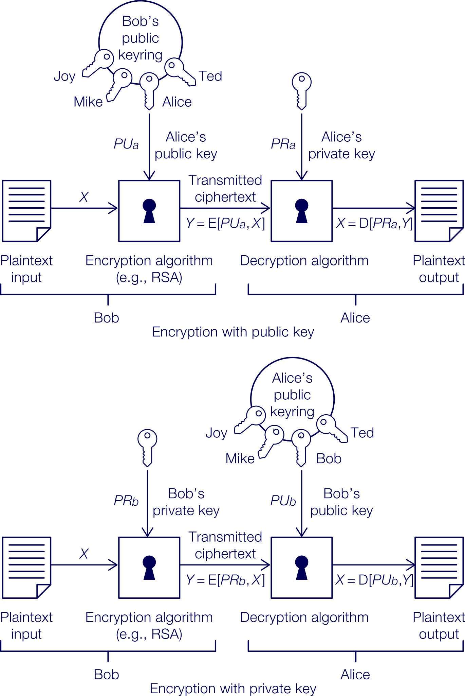

# INTE2665 - Week 04 - Cryptography Concepts (Part 2)

## 4.0.0 Week overview: Cryptography concepts part 2

Approx. 5 hours 40 minutes to complete all tasks in this week

## Welcome to Week 4 of Introduction to Cyber Security

This week you’ll continue looking at cryptography, this time focusing on asymmetric encryption. Last 
week, you looked at symmetric encryption, which allows for secure communication but has some drawbacks. 
For example, encryption key distribution could be captured by attackers, which could compromise all 
future communications. The communicating parties may not even know that the encryption has been compromised.

Asymmetric encryption overcomes these challenges by allowing you to share a public key with anyone. In 
this way, the security of the encryption is not an issue anymore. Applications can use this scheme 
flexibly for diverse services (e.g., confidentiality, authentication and even for privacy). By understanding 
both asymmetric and symmetric encryption, you’ll be able to choose the right approach for your security 
needs. This content along with that in Week 3 will support your work in Assessment 1.

To develop your computer skills, you’ll continue working with GNU Privacy Guard (GPG). You’ll also be 
assessed on how to use these tools in Assessment 1.

This week contains less content than previous weeks because Assessment 1 is due this week.

## What you’ll learn this week

- Explain public key cryptography
- Explain how to retrieve plaintext from a cipher
- Describe how to do a cryptanalysis to determine a private key user
- Encrypt and decrypt a file using GPG

## Week 4 activities

This week, you will:

- Read about public key cryptography
- Perform an encryption and decryption using the RSA algorithm
- Retrieve plaintext from a cipher text using RSA
- Listen to a podcast with a cyber security professional discussing the use of cryptography and reflect
  on your role in this area
- Complete a cryptanalysis to determine the private key of a user
- Practise encrypting/decrypting files using GPG.

### 4.1.0 Activity: Exploring public key cryptography and signatures

Approx. 3 hours 30 minutes to complete all tasks in this activity

In this activity you’ll read about public key cryptography and you’ll practise cryptography through 
performing various tasks, including encrypting, decrypting and retrieving text from a cipher. Finally, 
you’ll listen to a podcast with a cyber security professional discussing the role of symmetric and 
asymmetric cryptography in cyber security.

Public key cryptography is commonly used by the industry for secure operations. It is also used in 
various programming environments to develop customised applications. Learning about public key 
cryptography can help you in designing secure applications for flexible environments.

### 4.1.1 Investigate public key cryptography

Approx. 1 hour to complete this task

#### What is public key cryptography?

In this task you’ll read about public key cryptography. This will provide the context for this activity
and for Assessment 1.

Public key cryptography is a flexible encryption scheme, where a public key can be shared freely, so 
data can be encrypted or decrypted using either public or private keys. Keys are generated in pairs. 
If the data is encrypted using a public key, then it needs to be decrypted using a private key.

Read - The following reading will help you learn more about public key cryptography.

> Read Chapter-3: Public-key Cryptography and Message Authentication: pages 96-111 

As you read, consider the following:

**Q: What are the differences between asymmetric and symmetric encryption schemes?**
**Q: Which type of scheme would be more expensive?**

### 4.1.2 Apply the RSA algorithm

Approx. 1 hour to complete this task

#### Practising encryption and decryption

In this task you’ll practise your encryption and decryption skills using the RSA algorithm.
This will support your work in Assessment 1.

#### Solve the problem

Perform the encryption and decryption using the RSA algorithm below and these values:

1. p = 3; q = 11, e = 7; M = 2
2. p = 5; q = 11, e = 3; M = 5
3. p = 7; q = 11, e = 17; M = 2
4. p = 11; q = 13, e = 11; M = 3
5. p = 17; q = 11, e = 7; M = 88

When you’ve finished, check your answers below.

Here is the RSA Algorithm

Key generation

Select p, q	p and q both prime, p ≠ q
Calculate n = p × q	
Calculate Փ (n) = (p – 1) (q – 1)	
Select integer e	gcd (Փ (n), e) = 1; 1<e< Փ(n)
Calculate d	de mod Փ(n) = 1
Public key	KU = {e, n}
Private key	KR = {d, n}

Encryption

Plaintext:	M < n
Ciphertext:	C = Me (mod n)

Decryption

Plaintext:	C
Ciphertext:	M = Cd (mod n)

#### Answers

1. n = pq = 33, ϕ(n) = (p – 1)(q – 1) = 20, e = 7, de mod 20 = 1, so d = 3.
PU = {7, 33}, PR = {3, 33}

C = 27 mod 33 = 29

2. n = pq = 55, ϕ(n) = (p – 1)(q – 1) = 40, e = 3, de mod 40 = 1, so d = 27.
PU = {3, 55}, PR = {27, 55}

C = 53 mod 55 = 15

3. n = pq = 77, ϕ(n) = (p – 1)(q – 1) = 60, e = 17, de mod 60 = 1, so d = 53.
PU = {17, 77}, PR = {53, 77}

C = 217 mod 77 = 18

4. n = pq = 143, ϕ(n) = (p – 1)(q – 1) = 120, e = 11, de mod 120 = 1, so d = 11.
PU = {11, 143}, PR = {11, 143}

C = 311 mod 143 = 113

5. n = pq = 187, ϕ(n) = (p – 1)(q – 1) = 160, e = 7, de mod 160 = 1, so d = 23.
PU = {7, 187}, PR = {23, 187}

C = 887 mod 187 = 11

### 4.1.3 Discuss encryption problems

Approx. 1 hour to complete this task

#### Solving RSA encryption problems

In this task you’ll solve and discuss your results for two encryption problems using 
RSA. This will provide practice for Assessment 1.

Discuss - Consider the two encryption problems.

1. In a public-key system using RSA, you intercept the ciphertext C = 16 sent to a user whose public 
   key is e = 6, n = 40. What is the plaintext M?
2. In an RSA system, the public key of a given user is e = 7, n = 137. What is the private key of this user?

>Check the RSA arithmetic directly and also verify if the given public keys are actually valid 
RSA parameters, because one of these examples has a structural issue that affects whether there is a 
unique answer. These two examples are not valid RSA setups as written, so the strict RSA answer matters:

1. For Problem 1, there is no unique plaintext.
2. For Problem 2, there is no valid RSA private key unless you treat the exercise as a simplified modular-arithmetic problem.

Deet's:

1. Problem 1: `C = 16, e = 6, n = 40`

In RSA, decryption requires a private exponent `d` such that

$$de \equiv 1 \pmod{\varphi(n)}$$

But here:

- $n = 40$
- $\varphi(40) = 16$
- $e = 6$

We need $6d \equiv 1 \pmod{16}$, but this is impossible because

$$\gcd(6,16)=2 \ne 1$$

So $e=6$ has no modular inverse modulo $16$, which means this is not a valid RSA public key.

If you instead just solve the congruence

$$M^6 \equiv 16 \pmod{40}$$

there are multiple solutions:

$$M \equiv 4,6,14,16,24,26,34,36 \pmod{40}$$

So the plaintext is not unique.

Most correct answer:
- No unique plaintext exists because the given key is not a valid RSA key.

2. Problem 2: e = 7, n = 137

RSA requires:

$$n = p \times q$$

with distinct primes $p$ and $q$.

But $137$ is itself prime, so this is not a valid RSA modulus in the usual RSA setup. Strictly speaking, there is no proper RSA private key.

If your instructor expects you to proceed anyway as a modular inverse exercise, then use:

- since $137$ is prime, $\varphi(137)=136$
- find $d$ such that

$$7d \equiv 1 \pmod{136}$$

Testing:

$$7 \times 39 = 273 \equiv 1 \pmod{136}$$

So:

$$d = 39$$

and the private key would be:

$$K_R = \{39, 137\}$$

Final answers you can submit, depending on how strict your class expects RSA to be:

1. Problem 1: invalid RSA key, so no unique plaintext; possible values are $M = 4,6,14,16,24,26,34,36 \pmod{40}$
2. Problem 2: if treated as a modular inverse exercise, private key is $\{39,137\}$; strictly speaking, $n=137$ is not a valid RSA modulus

### 4.1.4 Learn from cyber security professionals

Approx. 30 minutes to complete this task

#### Cryptography real-world use

In this task you’ll listen to a podcast with a cyber security professional discussing the use of 
symmetric and asymmetric cryptography in cyber security. This will give you a better understanding 
of this area in a real-world context.

As you have read, there are two main categories of encryption schemes: symmetric and asymmetric. 
Whether you choose one over the other depends on the situation. Both schemes are used widely 
around the world today.

As you listen, consider the following:

**Q: What skills would you need to develop to be a good cryptanalyst?**

To be a good cryptanalyst, I think you need strong mathematical ability, creativity, persistence, 
and critical thinking. You also need curiosity and the ability to think like an attacker so you 
can understand how systems might be broken and how to defend them better.

- Strong mathematics, especially comfort with large numbers and abstract thinking
- Creativity
- Persistence, because some cryptanalytic problems take years
- Cultural awareness, so you understand why people use encryption and in what context
- Critical thinking, curiosity, and an analytical mindset
- The ability to think like an attacker in order to build better defences

**Q: Why might an organisation choose symmetric encryption or asymmetric encryption?**

An organisation might choose symmetric encryption because it is faster and more efficient for 
encrypting large amounts of data. It might choose asymmetric encryption when it needs secure key 
exchange or identity verification. In practice, many organisations use both together.

- Symmetric encryption uses the same shared key to encrypt and decrypt
- Asymmetric encryption uses a public/private key pair
- Asymmetric operations are computationally expensive, so in practice organisations usually combine 
  both methods

**Q: How efficient is AES?**

AES is very efficient and much stronger than older schemes like DES. Its larger key sizes make 
brute-force attacks far less practical, so it is considered much safer for modern use.

- AES was developed in response to increasing computer speeds
- AES uses a much larger key than DES
- DES used 56-bit keys, which are now relatively easy to brute force
- AES at 256 bits has a vastly larger key space and is much harder to crack

### 4.2.0 Activity: Applying GPG and cryptography – part 2

Approx. 2 hours 10 minutes to complete all tasks in this activity

Last week you started practising commands using GNU Privacy Guard (GPG) for encryption and decryption.

This week you’ll continue working with this tool, which will be used for Assessment 1. This is the 
final week to work with encryptions.

### 4.2.1 Practise GPG

Approx. 1 hour 30 minutes to complete this task

#### Practising using GPG
In this task you’ll continue practising encrypting and decrypting files using GPG. This utilises 
the direct skills that you’ll need for Assessment 1.

Read (optional) - You can refer to the following manuals for more information about GPG as you 
practise:

The GNU privacy handbookLinks to an external site https://www.gnupg.org/gph/en/manual.html

PGP user’s guide, volume I: essential topicsLinks to an external site https://web.pa.msu.edu/reference/pgpdoc1.html

#### Practise

Go to the Lab manual and navigate to **Weeks 3-4**. Continue to practise the following:

- Generating different-sized keys
- Encrypting a file using different-sized keys
- Creating, encrypting and decrypting a 1 MB file
- Calculating how long it will take to perform an encryption/decryption
- Exporting a public key
- Encrypting a file and outputting the cipher text in ASCII format
- Exchanging a public key using email or SCP
- Importing a public key into your key ring
- Encrypting a file using a public key and sending it
- Decrypting an encrypted file

NOTE:

- This is your last week to practise encryption.
- You may wish to divide your time over multiple sessions.

### 4.2.2 Reflect on using GPG

Approx. 40 minutes to complete this task

#### Assessing your progress

In this task you’ll reflect on your time practising using GPG. This will help you to consolidate 
your understanding and use of this important tool and will prepare you for Assessment 1.

#### Reflect

Consider your work using GPG this week. Write a reflection in your journal considering the following:

- How have you improved since you started practising encryption?
- Which commands do you feel most confident using?
- Which areas would you like to continue to work on after this course?