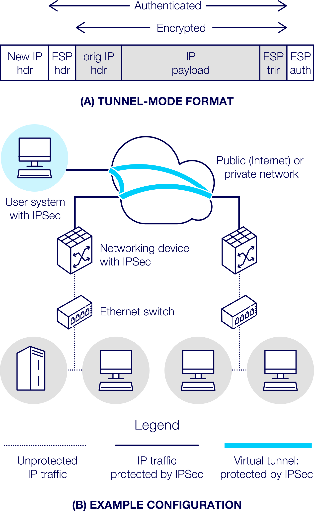
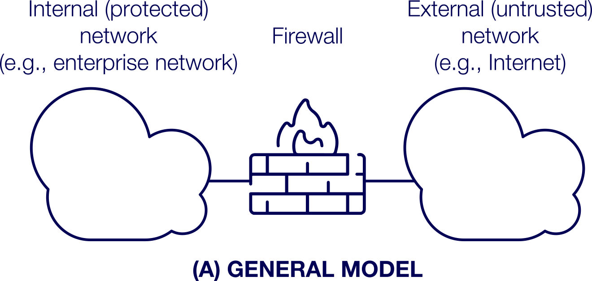

# INTE2665 | Week 5: Network security – part 1

## 5.0.0 Week overview: Network security – part 1

Welcome to Week 5 of Introduction to Cyber Security

This week you’ll start looking at Internet Protocol (IP) security and firewalls. This material along
with that in Week 6 will provide the context for Assessment 2. An important concept in cyber security,
defence in depth is where multiple layers of defence are deployed to counter cyber-attacks. IP security
and firewalls are two layers that provide defence at the network level, and they secure organisational
boundary nodes. In this way, IP level traffic is secured end to end.

To develop your computer skills, you’ll begin working with packet filtering firewalls (iptables). You’ll
be assessed on how to use these tools in Assessment 2.

Finally, in this week and Week 6, we’ll look at ethics. This is an important area that touches all aspects
of cyber security. When working as a cyber security professional, you need to consider ethical behaviour,
especially when having access to sensitive or personal data.

## What you’ll learn this week

- discuss the architecture of IP security and its role in security internet traffic
- explain the use of firewalls in cyber security
- analyse a packet filtering firewall ruleset
- discuss the role of ethics in cyber security
- perform key commands using iptables.

## Week 5 activities

- read about IP security and firewalls
- discuss VPN security and firewall protections
- watch a video of cyber security professionals discussing firewalls and reflect on your role in this
  area
- analyse a packet filtering firewall ruleset
- read about, discuss and reflect on ethics and cybercrime
- practise using commands in iptables.

## 5.1.0 Activity: Exploring IP security

In this activity you’ll read about IP security (IPsec) and watch a video to review its applications.
Finally, you’ll participate in a discussion about the use of IPsec in encapsulating security payload (ESP).
IP addresses are used to route internet traffic around the world, so the IPsec mechanism needs to ensure
that it provides security without interfering with the fundamental function of IP protocol. This is a key
skill in cyber security.

### 5.1.1 Investigate IP security

#### What is IPsec?

In this task you’ll read about IP security (IPsec). This will provide the context for this activity and for
Assessment 2.

IPsec is especially important as it ensures that IP-based networks’ communications are secure and flexible
enough to allow the routing of traffic to destinations in the shortest possible time. The challenge lies in
which part of the IP packet should be encrypted: should it be whole packets or just payloads? IPsec provides
both options and the selection depends on the nature of the application.

Read - The learn more about IP security:

>> Read Chapter 9 pages 303-310 from: chapter-09_ip-security.txt

As you read, consider the following:

- What are the benefits of IPsec?
- How does IPsec play a vital role in establishing secure and accurate routing paths?
- What’s the difference between transport mode and tunnel mode?

### 5.1.2 Extend your knowledge of IPsec

#### What is the purpose of the IPsec protocol?

In Task 5.1.1 you read about IPsec. In this task you’ll investigate this area in more detail. This
will give you greater understanding and will help you complete Assessment 2.

This video [What is IPsec](https://youtu.be/wLaemC1E-Yw) provides an overview of IPsec protocol - IPsec 
basics (4:20 min) 

 

As you watch, consider the following:

- What factors should be considered when selecting the best IPsec architecture for given applications?
- One of the challenges in symmetric encryption (AES) is the key exchange. IPsec uses AES. Do you think
  it would be possible to use RSA (asymmetric encryption) and would key exchange have any implications?

### 5.1.3 Task 3 - Discuss IP security

#### How does IPsec provide security?

In this task you’ll discuss VPN and IPsec. This will help you prepare for Assessment 2.

##### Discuss

Look at the following graphic. Consider how the VPN is secured with the use of IPsec in encapsulating
security payload (ESP). Discuss the following:

- Why does IPsec use different modes for different segments of the network in providing end-to-end security
  for the VPN?
- Why is traffic not protected behind the firewalls?
- Would a new IP header in tunnel mode format have any relevance to the original IP header?
- Comment on the level of security overall in ESP.

The use of IPsec in encapsulating security payload (ESP). Source: RMIT Online, adapted from Stallings (2017).
Reprinted by permission of Pearson Education, Inc.

## 5.2.0 Activity: Examining firewalls

In this activity you’ll look at firewalls. Firewalls provide control to security professionals within
an organisation, allowing them to manage access to the organisation’s cyber assets. Because of organisations’
changing needs, it is important for security professionals to be able to configure firewalls by writing
rules to regulate the access. You’ll read about firewalls and watch a video with cyber security professionals
discussing different types of firewalls. Then you’ll apply your knowledge by reflecting on IPsec methods
and analysing a packet filtering firewall ruleset.

### 5.2.1 Task 1 - Examine firewalls

#### What are the different types of firewalls?

In this task you’ll read about firewalls. This will provide context for this activity and will support your
work in Assessment 2.

Firewalls are the first line of defence for an organisation. They watch traffic going in and out of the
organisation’s network. They can reject a connection to the organisation’s network and applications; similarly,
they can deny outward connections attempted by employees.

Firewalls as the first line of defence. Source: RMIT Online, adapted from Stallings (2017)

Read - To learn more about firewalls:

>> Read Chapter 12 pages 411-420 and 423-428 from: chapter-12_firewalls.txt

As you read, consider these questions:

- What is the relationship between the correct configuration of a firewall and its goals for a given organisation?
- How could weaknesses of packet filtering firewalls be exploited by cyber criminals?

### 5.2.2 Task 2 - Learn from cyber security professionals

#### Firewall real-world use

In this task you’ll watch interviews with cyber security professionals discussing different types of
firewalls. This will give you a better real-world understanding of this area of cyber security.

The function of the firewalls is to provide perimeter protection to organisations; they are used along
with other measures. Firewalls could be software based or could have specialised hardware. This could
be due to vendor-specific reasons and/or application of the firewalls.

Watch the video - Using firewalls (4:12 min)

Watch the following video in which cyber security professionals discuss the use of firewalls.

As you watch, consider these questions:

- How are firewalls used in defence in depth?
- What are the strengths and limitations of firewalls?
- Why are IPsec firewalls more reliable?

>> Transcript (INTE2665_5_2_2_How do firewalls help protect organisational networks.txt)

### 5.2.3 Discuss IP security methods

#### Attacks and security effectiveness

In this task you’ll reflect on types of security attacks and how best to defend against them using
firewalls. This will help you prepare for Assessment 2.

#### Discuss:

You’ve read about various types of systems attacks, including:

- IP address spoofing
- source routing
- tiny fragment attacks on packet filtering firewalls.

Consider these questions:

- What measures could be taken to counter these attacks?
- What might be the limitations of these measures?

Share your ideas on the discussion board.

Read at least two posts by your peers.

- Do you agree with their ideas? Are there any measures you hadn’t considered? Comment on the
  effectiveness of their ideas.

### 5.2.4 Analyse a ruleset

#### Assessing a packet filtering firewall ruleset

In this task you’ll analyse a packet filtering firewall ruleset. This will help you prepare for
Assessment 2.

##### Solve the problem

The following table shows a sample of a packet filtering firewall ruleset for an imaginary network
of IP addresses that range from 192.168.1.0 to 192.168.1.254.

Describe the effect of each rule.

When you’ve finished, check your ideas with the answers below.

| Rule | Source address | Source port | Destination address | Destination port | Action |
| ---- | -------------- | ----------- | ------------------- | ---------------- | ------ |
| 1    | Any            | Any         | 192.168.1.0         | >1023            | Allow  |
| 2    | 192.168.1.1    | Any         | Any                 | Any              | Deny   |
| 3    | Any            | Any         | 192.168.1.1         | Any              | Deny   |
| 4    | 192.168.1.0    | Any         | Any                 | Any              | Allow  |
| 5    | Any            | Any         | 192.168.1.2         | SMTP             | Allow  |
| 6    | Any            | Any         | 192.168.1.3         | HTTP             | Allow  |
| 7    | Any            | Any         | Any                 | Any              | Deny   |

_Source: Adapted from Network security essentials: applications and standards Stallings (2017), page 430._

#### Answers:

1. Allow return TCP Connections to internal subnet.
2. Prevent firewall system from directly connecting to anything.
3. Prevent external users from directly accessing the firewall system.
4. Internal users can access external servers.
5. Allow external users to send email in.
6. Allow external users to access WWW server.
7. Everything not previously allowed is explicitly denied.

_Source: Adapted from Network security essentials: applications and standards (Stallings 2017), page 430._

### 5.3.0 Activity: Considering ethics and cybercrime

In this activity you’ll read about ethics and cybercrime and watch a video of industry professionals 
discussing key areas in cybercrime. Then you’ll apply your understanding by discussing the need for 
ethics in cybercrime to reduce global cybercrime and then reflect on your own thoughts on the cybercrime 
code of conduct for global rules of engagement.

#### 5.3.1 Explore ethics and cybercrime

##### How does ethics relate to cybercrime?

In this task you’ll read about ethics and cybercrime. This will provide the context for this activity 
and support your work in Assessment 2.

In cyber security it’s vital to clearly understand what’s a crime and what’s a legitimate cyber activity. 
Cyber security ethics establishes boundaries for where we as practitioners can go to collect evidence for 
cybercrimes. However, these boundaries can be very vague, so it is possible that investigators could 
unknowingly breach laws.

Read - To learn more about ethics in cyber security.

> Read Chapter 14 pages 2-6 and 18-24 from: chapter-14_legal-and-ethical-aspects.txt

As you read, consider these questions:

- What is the relationship between computers and real-world crimes? How many computer crimes are reported in the press?
- Why is it hard to prove a computer crime in a court of law?
- How are rules and a code of ethics related? What is the difference between them?

### 5.3.2 Learn from cyber security professionals

#### Cybercrime in the real world

In this task you’ll watch interviews with cyber security professionals discussing cybercrime. This will 
give you a better real-world understanding of this overarching area of cyber security.

Cybercrimes are committed by people who have advanced technical skills and so know how to cover up their 
crimes. In cyber security, it’s important to continue to upskill to stay ahead of the cyber criminals.

Watch the following video in which cyber security professionals discuss cybercrime.

>> Transcript (INTE2665_5_3_2_What are the key issues in cyber-crime.txt)

As you watch, consider these questions:

- What are the challenges faced by law enforcement agencies in solving the cybercrimes?
- What are the ethical considerations for prosecuting cybercrimes?
- How could governments and private sectors help in deterring cybercriminals?

### 5.3.3 Research ethics and cybercrime

#### The need for ethics in cybercrime

In this task you’ll research cybercrime and discuss how cybercrime is punished. This will broaden your
understanding of key issues in cybercrime and ethics.

#### Research:

Research cyber security crimes.

Identify five crimes committed recently and their impact on the industry.

#### Discuss

Choose one of the cybercrimes.

Share your ideas on the discussion board. Be sure to include:

- a summary of the cybercrime and a link to the article/website
- an assessment of its impact on the industry
- whether you thought the outcome was acceptable (Were the alleged offender/s found guilty? What 
  was the punishment? Did it fit the crime?).

Read at least two posts by your peers.

- Was the punishment appropriate? Why or why not?

### 5.3.4 Reflect on ethics in cybercrime

#### Reflecting on your role in preventing cybercrime

In this task you’ll reflect on the role of the cyber security professional in reducing global cybercrime.
This will help you prepare for Assessment 2.

#### Reflect

Reflect on your personal feelings on the need for ethics and a cybercrime code of conduct for global 
rules of engagement.

- Could global rules of engagement and a code of ethics reduce cybercrime?
- Is it possible to have and enforce global rules of engagements?

## 5.4.0 Activity: Applying packet filtering firewalls (iptables) - part 1

In this activity you’ll be introduced to iptables, a packet filtering firewall tool. You’ll practise 
using iptables and reflect on your efforts. Next week, you’ll continue to practise using iptables. 
This tool will be used for Assessment 2. Please raise any questions or problems you are having with 
your online facilitator.

### 5.4.1 Practise iptables

#### Practising using iptables

In this task you’ll be introduced to iptables and start to practise using this key tool. This provides
experience in the direct skills that you’ll need for Assessment 2.

Introduction to packet filtering firewalls (iptables)

Iptables is a firewall utility program that is built into the Linux operating system. It uses chains 
of rules to allow or block traffic. When a packet arrives or leaves, the iptables matches it against 
rules in the chains one by one. When it finds a match, it performs the action associated with it. If 
it doesn’t find a match, it performs the default action.

#### Practise

Go to the Lab manual and navigate to Weeks 5-6 Packet Filtering Firewalls (iptables). Over the next 
two weeks, practise the following:

- adding chains to rules
- viewing line numbers with the rules
- deleting rules
- checking SSH, HTTP and MySQL servers
- connecting the MySQL server to other computers
- connecting to SSH, Web and MySQL servers.

NOTE:

- You don’t need to complete all the commands this week. Next week, you’ll have more time allocated
  to continue practising iptables.
- You may wish to divide your time practising using iptables over multiple sessions.

### 5.4.2 Reflect on using iptables

#### Assessing your progress

In this task you’ll reflect on your use of iptables. This will help you to consolidate your understanding
 and use of this important tool and will help prepare you for Assessment 2.

#### Reflect

Consider your work using iptables this week. Write a reflection in your journal considering the following:
- What applications can use iptables?
- Which commands do you feel most confident using?
- Which areas could you improve in?

---

END OF WEEK 5 MODULE -> MOVE ON TO LAB WORKSHOP FOR WEEK 5 to 6
