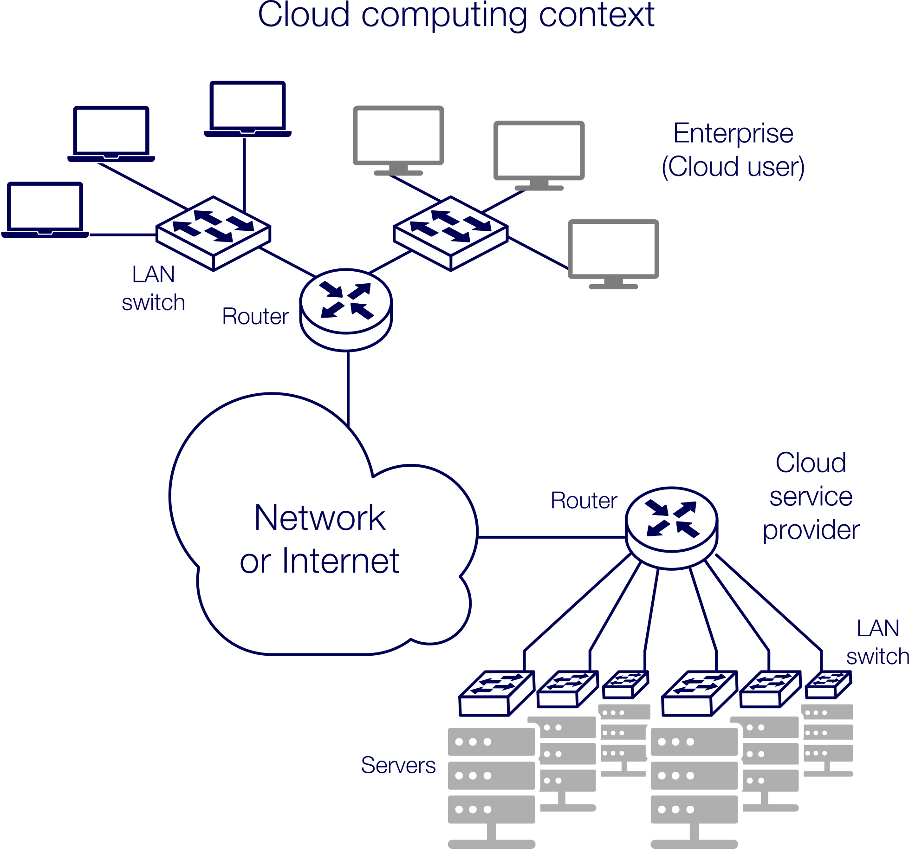

# INTE2665 | Week 7 | Cloud Security

## 7.0.0 Week overview: Cloud security

Welcome to Week 7 of Introduction to Cyber Security

This week you’ll look at cloud security, including security risks and malicious software. Cloud 
security is an extensive area in cyber security, as many organisations have adopted cloud technologies.
Cloud services from third parties allow for greater flexibility but also requires these businesses 
to manage new security risks.


## What you’ll learn this week

- explain cloud computing architecture and security risks
- describe malicious software
- discuss cloud-based data services and data breaches
- analyse a code.


## Week 7 Activities

- Read about Cloud Computing Architecture and Security Risks
- Compare and research Cloud-Based Data Services
- Watch a video of Cyber Security Professionals discussing Malicious Software
- Analyse a Code and Determine if it’s Malicious.


### 7.1.0 Activity: Exploring cloud computing architecture and security risks


In this activity you’ll explore cloud computing. This is an important topic because an understanding
of cloud architecture can help to determine the types and severity of cyber risk to cloud networks. 
You’ll read about cloud computing architecture, and about security risks and countermeasures. You’ll 
then investigate key terminology and consider how it changes in the context of cloud computing. Finally, 
you’ll compare cloud-based data services in key areas and research security breaches on cloud-based services.


#### 7.1.1 Explore cloud computing architecture and security risks

##### Security risks in cloud computing architecture

In this task you’ll read about cloud computing architecture, and about security risks and countermeasures. 
This will provide the context for this activity. This content will be assessed on your **EXAM IN ASSESSMENT 3**.

Cloud computing is a very flexible environment where resources can be acquired depending on the needs of 
organisations. Investments in computing resources can be planned with the future expansion of a business 
in mind. Data is considered one of the biggest assets from which organisations derive values to improve 
their processes and to make value-adding decisions. However, there are many risks to data held in the cloud, 
so countermeasures need to consider any danger to the data during storage and transmission.




##### READ - To learn more about cloud computing architecture and cloud security risks

> Read Chapter-5 Network_Access-Control-and-Cloud-Security pages 170-182 

As you read, consider these questions:

- How can a combination of different cloud computing models and essential characteristics be selected 
  to tailor diverse types of cloud deployment models?

- How are security threats different for cloud environments than in-house servers for computing services
  (e.g., malicious insider attacks)?

- How do multi-instance and multi-tenant models for data storage work in cloud environments?


#### 7.1.2 Task 2: Analyse terminology in context

##### Review key terminology

In this task you’ll review key terminology and identify their meaning in the context of cloud security. 
This will check your understanding and help you consolidate your learning.


##### Check your understanding

The following terms can have a different meaning outside and inside the context of cloud computing:

- governance
- compliance
- trust
- architecture
- identity and access management
- software isolation
- data protection
- availability
- incident response.

Choose one of the terms above. Write a definition for the term:

- outside of cloud security
- within cloud security.

How has the meaning changed?


#### 7.1.3 Task 3: Compare cloud-based data services (NOT EXAM ASSESSIBLE)

##### How effective are cloud-based data services?

In this task you’ll compare some cloud-based data services and discuss your ideas. This will help 
you to understand what types of security services the cloud can provide to users, so they can transfer 
their risk to cloud operators.


##### DISCUSS

There are many types of cloud-based data services. Choose two to three examples from the box below. 
Compare your chosen services in relation to the following areas:

- Encryption
- Flexibility
- Efficiency
- Speed
- Ease of use.

Cloud-based data service examples:

- Salesforce
- SAP ERP
- Sage Business Cloud People
- Slack
- Google Hangouts
- Dropbox
- Forcepoint
- Data lake

Source: Adapted from Problem 5.3 in Network security essentials: applications and standards (Stallings 2017), page 186.

NOTE: You will investigate these data services more in Task 7.1.4.


#### 7.1.4 Task 4: Research security breaches (NOT EXAM ASSESSIBLE)

##### Investigate - real-world security breaches

In Task 7.1.3 you compared some data services. In this task you’ll research **one** of these companies and 
investigate their security breaches.


##### RESEARCH

Choose one of the data services from Task 7.1.3.

Research any security breaches in the recent past. Consider:

- What was the cause of the breach?
- What changes did the service make after the attack?


##### DISCUSS

Share your ideas on the discussion board. Be sure to include:

- a summary of the attack and a link to the article/website you sourced the information from
- any changes the service made after the attack.

Read at least two posts by your peers.

- Comment on how the companies responded to the attacks. How were they similar or different?

Source: Adapted from Problem 5.3 in Network security essentials: applications and standards (Stallings 2017), page 186.


### 7.2.0 Activity: Investigating malicious software

In this activity you’ll look at malicious software. This is a prevalent problem in cyber security today. 
Malicious software development is common. There are even toolkits available that freely devise new malicious 
software to exploit vulnerabilities. Industries require skills in monitoring, identifying, analysing and 
removing malicious software from their systems. You’ll read about malicious software and watch a video of 
cyber security professionals discussing it. Then, you’ll analyse a piece of code to determine if it’s 
malicious or not.


#### 7.2.1 Investigate malicious software


##### Malicious software and cyber-attacks

In this task you’ll read about malicious software. This will provide the context for this activity 
and will be assessed as part of your **EXAM IN ASSESSMENT 3**.

Malicious software, known as either malware or ransomware, uses certain behaviours to launch cyber-attacks
on target systems. The behaviours are grouped together depending on the nature of the target computer system
and the applications. For example, banking malware has behaviours to infect e-banking webpages, steal user 
credentials and use these details to steal money.

##### READ - More information about malicious software

> Read Chapter-10_malicious-software.txt pages 338-347

As you read, consider the following:

- Malware can be categorised into two broad categories: (1) malware propagation; (2) an action performed at
a target. Based on these two categories, how could banking malware and ransomware attacking a hospital be 
differentiated?

- How do advanced persistent threat attacks differ from other types of attacks (e.g., a cyber-attack on a bank)?


#### 7.2.2 Learn from cyber security professionals

##### Malicious software real-world use

In Task 7.2.1 you read about malicious software. In this task you’ll watch interviews with cyber security 
professionals discussing this issue. This will give you a better real-world understanding of this area of 
cyber security.

In the real world, malicious software could be designed to attack one particular organisation or to attack 
all organisations of a similar type. In these cases, malware authors will use different schemes as different 
levels of research are needed about the target industries.

##### Watch the video - Malicious software (4:55 min)

Watch this video, in which cyber security professionals discuss malicious software. As you watch, consider
the following:

- What skills are needed to deal with malicious software?
- What countermeasures can be deployed to counter malware attacks?

>> Transcript - INTE2665_7_2_2_What are the key problems and solutions with malicious software.txt


#### 7.2.3 Analyse a code

##### Malicious or not?

In this task you’ll analyse a piece of code to decide if it’s malicious or not. This will help you to 
understand the role of the malware analyst. In most cases, malware source codes aren’t available, so 
analysts have to work with binary codes, which requires extensive programming skills.

##### SOLVE THE PROBLEM

Is it possible to develop a program that can analyse a piece of software to determine if it’s a virus?

Consider that we have a program D that is able to determine a virus. That is, for any program P, if 
we run D(P), the result returned is TRUE (P is a virus) or FALSE (P is not a virus). Now consider the 
program in the box below. In the preceding program, infect-executable is a module that scans memory for
executable programs and replicates itself in those programs. Determine if D can correctly decide whether 
CV is a virus.


>I don't know what the following is, but it looks like a piece of code that is trying to determine if a 
program CV is a virus or not.  The program D is supposed to analyze CV and return TRUE if it is a virus 
and FALSE if it is not. However, the program CV calls D to check if it is a virus, and based on the result, 
it either goes to the next step or infects an executable. The problem is that D always returns the wrong 
answer, so it will incorrectly classify CV as a virus or not a virus, leading to incorrect behavior in CV.

```sudo-code
Program CV :=
 { . . .
 main-program :=
      {if D(CV) then goto next:
           else infect-executable;
      }
  next:
   }
```

##### ANSWER

D is supposed to examine program P and return TRUE if P is a computer virus and FALSE if it is not. 
But CV calls D. If D says that CV is a virus, then CV will not infect an executable. But if D says 
that CV is not a virus, it infects an executable. D always returns the wrong answer.

Source: Adapted from Problem 10.2 in Network security essentials: applications and standards (Stallings 2017), pages 372-373.


### 7.3.0 Activity: Preparing for Assessment 3

#### 7.3.1  Assessment 3: Exam preparation

- Points = 5
- Questions = 5
- No time limit


Question 1 - 1 / 1 pts

Which one of the following deployment models in the cloud is operated solely for an organisation?
- Public cloud 
- Private cloud (ANS)
- Hybrid cloud 
- Personal cloud 


Question 2 - 0.5 / 1 pts

Which of the following is/are cloud-specific security threats listed by the Cloud Security Alliance? (click any that apply)
- Data loss or leakage (ANS)
- Insecure design (UNKNOWN)
- Malicious insiders (ANS)
- Secure interfaces and APIs (WRONG ANS)


Question 3 - 1 / 1 pts

Which one of the following refers to a computer program that collects information from a computer and transmits it to another system?
- Spyware (ANS)
- Virus 
- Trojan horse 
- Worm 
 

Question 4 - 0.5 / 1 pts

Which of the following statements about Advanced Persistent Threats (APTs) is/are true? (Click any that apply)
- Attackers use a wide variety of intrusion technologies and malware, including the development of custom malware if required. (ANS)
- All individual components are technically advanced and carefully selected to suit the chosen target. (UNKNOWN)
- A variety of attacks are often stealthily applied over a short period of time. (WRONG ANS)
- Attackers intend to compromise the specifically chosen targets. (ANS)


Question 5 - 1 / 1 pts

Which of the following is/are not the components of a computer virus?
- Kit (ANS)
- Trigger 
- Payload 
- Infection mechanism 

---

END OF WEEK-7 MODULE -> MOVE ON TO LAB WORKSHOP WEEKS 7-8