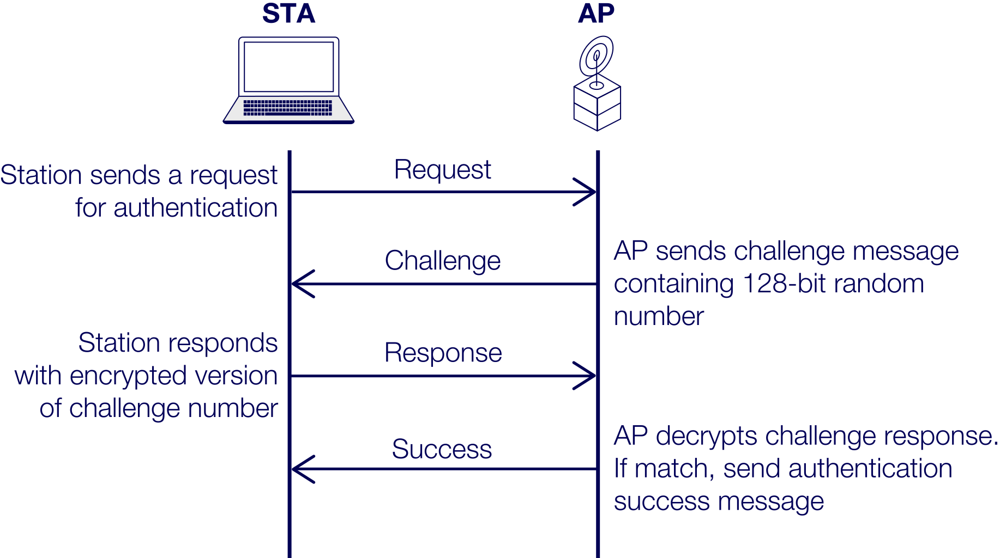

# INTE2665 | Week 8: Wireless Security

## 8.0.0 Week overview: Wireless security

Welcome to Week 8 of Introduction to Cyber Security

This week you’ll start looking at wireless security. Wireless security is important for a cyber security
professional to have a working knowledge of because most applications now run on mobile/wireless devices. 
Wireless devices are the prime target of cyber-attacks. Cybercriminals particularly attack applications 
related to internet banking and e-commerce to steal information and money, so it is important to understand 
the basics of wireless network architecture and associated cyber risks.

To develop your computer skills, you’ll begin working with the network protocol analyser Wireshark. Being 
able to capture network traffic and then do an analysis of the traffic to determine any anomaly are 
important skills. Wireshark is used by the industry to do network traffic analysis at protocol levels – 
for example, data link, network, transport and application. Detection of cyber-attacks at all levels can 
improve the security of systems.

## What you’ll learn this week

- Explain wireless, mobile device and wireless local area network (WLAN) security
- Compare wireless security and mobile device security
- Analyse an authentication scheme
- Perform key commands using Wireshark.

## Week 8 Activities

- Read about wireless, mobile device and wireless WLAN security
- Discuss the difference between wireless and mobile device security
- Listen to a podcast with a cyber security professional discussing wireless security and reflect 
  on your role in this area
- Analyse an authentication scheme
- Practise using commands in Wireshark.

## 8.1.0 Activity: Exploring wireless security and mobile device security

In this activity you’ll read about wireless security and mobile device security and then listen to a 
podcast with a cyber security professional discussing these types of security. You’ll also participate
in a discussion on the difference between wireless security and mobile device security. This will help
you to understand the nature of cyber-attacks that take advantage of device mobility. Mobile devices
can connect with WLANs and mobile networks (3G/4G/5G/6G, etc.) which requires them to switch from one
type of infrastructure to another thus exposing the mobile devices to cyber risks.

### 8.1.1 Explore Wireless Security

#### How does Wireless Security prevent attacks?

In this task you’ll read about Wireless Security and mobile device security. This will provide the 
context for this activity and will be **ASSESSED IN ASSESSMENT 3**.

Wireless Security can prevent accidental and malicious associations with malicious networks minimising
the possibility of cyber-attacks on wireless devices. Wireless Security can prevent attackers from
locating wireless access points, and further encryption can prevent eavesdropping on wireless communication.

READ - To learn more about Wireless Security

>> Read Chapter-7 pages 223-230 from: chapter-07_p223-230_wireless-security-and-mobile-device-security.txt

As you read, consider the following:

**Q: What are the main security threats and countermeasures for Wireless Networks?**

   - **Security Threats for Wireless Networks:**

      - **Channel Attacks** - wireless communication is vulnerable to attacks such as eavesdropping, 
         jamming and interference.
      - **Mobility** - wireless devices can connect to different networks and can be used in different 
         locations which can expose them to various cyber threats.
      - **Resource Constraints** - wireless devices have limited resources such as processing power, memory 
         and battery life which can be exploited by attackers to launch attacks such as denial of service (DoS) 
         attacks or to bypass security measures.
      - **Accessibility** - wireless devices are more accessible to attackers than wired devices

   - **Countermeasures for Wireless Networks:**

      1.	Use encryption. 
      2.	Use antivirus and antispyware software, and a firewall.
      3.	Turn off identifier broadcasting.
      4.	Change the identifier on your router from the default.
      5.	Change your router’s pre-set password for administration.
      6.	Allow only specific computers to access your wireless network.

**Q: What security threats are due to the use of mobile devices with enterprise networks?**

   -  Lack of physical security controls
   -  Use of untrusted mobile devices
   -  Use of untrusted networks
   -  Use of applications created by unknown parties
   -  Interaction with other systems 
   -  Use of untrusted content 
   -  Use of location services

### 8.1.2 Compare and contrast wireless security and mobile device security

#### Wireless security versus mobile device security

In this task you’ll compare wireless security and mobile device security. This will help you prepare 
for **ASSESSMENT 3**.

##### DISCUSS

Consider wireless security and mobile device security.**

**Q: How are they the same?**

- Both aim to protect data and devices from unauthorized access and attacks.
- Both rely on encryption, authentication, and access control as core security measures.
- Both are concerned with threats like eavesdropping, man-in-the-middle attacks, and denial of service.
- Both require regular updates, antivirus/antispyware, and firewalls to mitigate risks.
- Both must address vulnerabilities due to device accessibility and exposure to untrusted networks.

**Q: How are they different?**

- **Scope of Protection:**
  - Wireless security focuses on securing the communication channel, access points, and the network 
   infrastructure (e.g., Wi-Fi, routers).
  - Mobile device security focuses on protecting the device itself, its data, applications, and its 
   interactions with other systems and networks.

- **Threats:**
  - Wireless security deals with threats like accidental/malicious association, ad hoc networks, MAC 
   spoofing, and network injection.
  - Mobile device security deals with threats like lack of physical security, use of untrusted devices/networks, 
   malicious apps, untrusted content, and location services misuse.

- **Countermeasures:**
  - Wireless security uses measures like signal hiding, SSID management, MAC filtering, and encryption 
   of transmissions.
  - Mobile device security uses device configuration (auto-lock, PIN/password, remote wipe), app 
   whitelisting, disabling location services, and restricting synchronization.

- **Mobility and Accessibility:**
  - Wireless security is about protecting the network as devices move and connect.
  - Mobile device security is about protecting devices that are inherently mobile and often outside 
   organizational control.

**Q: Which type of security is more vulnerable to cyber-attacks? Justify your answers.**
Mobile device security is more vulnerable.

**And here's why:**

- Mobile devices are often outside the physical and logical boundaries of the organization, making 
  them susceptible to theft, loss, and tampering.
- Users frequently connect to untrusted networks (public Wi-Fi, cellular), increasing exposure to 
  attacks like eavesdropping and man-in-the-middle.
- Users install apps from unknown sources, risking malware and data leakage.
- Devices synchronize with other systems and cloud services, which may not be secure.
- Location services and untrusted content (e.g., QR codes) introduce unique risks not present in 
  traditional wireless networks.
- BYOD (bring-your-own-device) policies mean IT cannot always enforce strict controls.

**Basically** Wireless security is vulnerable due to the broadcast nature of wireless communication, 
but organizations can more easily control access points, enforce encryption, and monitor network activity.

### 8.1.3 Task 3: Learn from cyber security professionals

#### Wireless security real-world use

In this task you’ll listen to an interview with a cyber security professional discussing wireless
security and mobile device security. This will give you a better real-world understanding of this
area of cyber security.

Wireless security enables the delivery of a flexible business model on the go. Cyber security is 
considered vital for business continuity, and wireless security makes new types of business models 
possible, as secure business can be conducted anytime and anywhere.

#### LISTEN

Wireless security and mobile device security (9:22 min)

Listen to the podcast below in which Iqbal Gondal, Associate Dean of Cloud Systems & Security at 
RMIT University, interviews Sean Duca, Vice President and Regional Chief Security Officer Asia Pacific
& Japan at Palo Alto Networks, about wireless security and mobile device security.

>> Transcript - INTE2665_8_1_3_What are key threats to wireless and mobile device security.txt

As you listen, consider the following:

**Q: What are the most common threats to wireless security and mobile device security?**

**Wireless security threats:**

- Piggybacking (unauthorized users connecting to unsecured wireless access points)
- War driving (attackers searching for open/unsecured wireless networks)
- Sniffing wireless traffic (eavesdropping on network communications)
- Unauthorized access to devices and data on the network

**Mobile device security threats:**

- Theft of the mobile device itself
- Data leakage or loss from malicious apps (apps that access and transmit sensitive data)
- Connecting to unsecure public Wi-Fi (risk of man-in-the-middle attacks)
- Poor password habits (reusing passwords across multiple sites, making accounts vulnerable if one is 
  compromised)

**Q: Why are domestic WLAN considered more vulnerable to drive-by cyber-attacks? And how can these 
   attacks be prevented?**

**Why more vulnerable:**

- Most people do not change the default settings on their routers provided by ISPs.
- Default usernames and passwords are often left unchanged and are widely known or published in manuals.
- Security features (like WPA2 encryption) are often not enabled by default.
- Attackers can easily identify and access these networks using default credentials or no security.

**How to prevent:**

- Enable the built-in security features on wireless access points (e.g., WPA2 encryption).
- Change the default username and password on the router to something strong and unique.
- Avoid leaving the network open or using weak security settings.

**Q: How can WLAN drive-by attacks be prevented?**

- Turn on security features such as WPA2 on your wireless access point.
- Change default admin credentials to strong, unique passwords.
- Regularly update router firmware to patch vulnerabilities.
- Be mindful of what devices are connected to your network and monitor for unknown devices.

**Pretty much**: The most common threats include unauthorized access, eavesdropping, malicious 
apps, and poor password practices. Domestic WLANs are more vulnerable due to unchanged default 
settings and lack of security. Prevention involves enabling encryption, changing default credentials, 
and keeping devices updated.

## 8.2.0 Activity: Exploring WLAN and WLAN security

In this activity you’ll read about wireless LAN and wireless LAN security and participate in a discussion
about the benefits and weaknesses of an authentication scheme. Then, you’ll do a deeper analysis of 
another authentication scheme. This is an important area as authentication mechanisms can filter out 
undesired attackers masquerading as legitimate users.

### 8.2.1 Exploring WLAN and WLAN Security

#### Why is wireless LAN security challenging?

In this task you’ll read about **Wireless LAN and Wireless LAN Security**. This will provide the context 
for this activity and will be **ASSESSED IN ASSESSMENT 3**.

Wireless LAN security is more complicated due to the nature of wireless infrastructure and its exposure
to unique cyber threats. The nature and severity of cyber threats need to be seen in the context of
infrastructure. Wireless devices’ ability to connect to WLAN automatically can be exploited by 
cybercriminals by setting up malicious WLAN base stations or by installing malicious applications on 
existing WLANs.

#### READ - More about wireless LAN and wireless LAN security

>> Read Chapter 7 pages 230-250 from: chapter-07_p230-250_ieee802-11.txt

As you read, consider the following:

1. What are the most important elements of IEEE 802.11 wireless LAN standard?

   MY ANSWER:

   *The most important elements of **IEEE 802.11** are the **Physical layer**, **MAC layer**, and **WLAN architecture**
   components such as stations, access points, BSS, DS, and ESS. The Physical layer handles wireless 
   transmission and frequency bands, while the MAC layer controls access to the medium, framing, addressing, 
   and error detection.*

2. What are the components of IEEE 802.11i wireless LAN security architecture?

   MY ANSWER:

   *The main components of IEEE 802.11i wireless LAN security architecture are authentication, access 
   control, and privacy with message integrity. It uses the STA, AP, and authentication server (AS), 
   with protocols such as IEEE 802.1X and EAP, plus security mechanisms like TKIP, CCMP, and key 
   management using PMK, PTK, and GTK.*

3. How does integration service enable the transfer of data between wireless and wired LANs?

   MY ANSWER:

   *Integration service enables communication between a wireless IEEE 802.11 LAN and a wired IEEE 802.x 
   LAN through the distribution system. It handles the address translation and media conversion needed 
   so data can move between wireless and wired devices.*

### 8.2.2 Discuss an Authentication Scheme

#### Analysing security effectiveness

In this task you’ll discuss an authentication scheme and consider its benefits and drawbacks. 
This will support your learning for **ASSESSMENT 3**.

#### DISCUSS

Read the authentication scheme description below:

"In IEEE 802.11, an open system authentication simply consists of two communications. An authentication 
is requested by the client, which contains the station ID (typically the MAC address). This is followed
by an authentication response from the AP/router containing a success or failure message. An example of
when a failure may occur is if the client’s MAC address is explicitly excluded in the AP/router 
configuration."

Consider what the benefits are of this authentication scheme.

**Q: Comment on the possible security vulnerabilities of this authentication scheme**

*Open system authentication is beneficial because it is simple, fast, and compatible with older 
IEEE 802.11 devices. It allows the STA and AP to exchange identifiers and begin association with 
minimal overhead. However, it is insecure because it provides no real security, only identifier 
exchange. It does not provide strong authentication, confidentiality, integrity, or key generation, 
so it is vulnerable to unauthorized access and identifier spoofing in a wireless environment.*

Note: You’ll continue to analyse authentication schemes in Task 8.2.3.

Source: Adapted from Problem 7.1 in Network security essentials: applications and standards (Stallings 2017), page 251.

### 8.2.3 Analyse an authentication scheme

#### Discussing an encryption scenario

In Task 8.2.2 you discussed IEEE 802.11. In this task you’ll analyse the previous security scheme that was
used: Wired Equivalent Privacy (WEP). This will help you prepare for **ASSESSMENT 3**.

#### SOLVE THE PROBLEM

Read the authentication scheme description below:

"Prior to the introduction of IEEE 802.11i, the security scheme for IEEE 802.11 was WEP. This assumed 
all devices in the network share a secret key. The purpose of the authentication scenario is for the
security threat analysis (STA) to prove that it possesses the secret key. Authentication proceeds as
shown in the following graphic. The STA sends a message to the access point (AP), requesting authentication.
The AP issues a challenge, which is a sequence of 128 random bytes sent as plaintext. The STA encrypts
the challenge with the shared key and returns it to the AP. The AP decrypts the incoming value and compares
it to the challenge that it sent. If there is a match, the AP confirms that authentication has succeeded."

#### CONSIDER - the following questions:

1. **Q: What are the benefits of this authentication scheme?**

*The benefit of this scheme is that the AP can test whether the STA knows the shared secret key. Because the AP sends a random challenge and checks the encrypted response, a correct reply shows that the STA likely possesses the key. It is also a simple and direct authentication method.*

2. **Q: This authentication scheme is incomplete. What is missing and why is this important? Hint: The 
   addition of one or two messages would fix the problem.**

*What is missing is mutual authentication. The scheme proves the STA knows the key, but it doesn't prove that the AP knows the key or is a legitimate AP. This is important because a rogue AP could pretend to be genuine. Adding one or two messages so the AP also proves knowledge of the key would make the authentication two-way.*

3. **Q: What is a cryptographic weakness of this scheme?**

*A cryptographic weakness is that an attacker who listens to the exchange gets both the plaintext challenge and the encrypted version of that same challenge. This gives the attacker a plaintext-ciphertext pair that can be used in cryptanalysis. This fits the attached chapter’s point that WEP had major weaknesses and was later replaced by stronger IEEE 802.11i security mechanisms.*

LECTURERS ANSWERS:

1. Because the AP remembers the random number previously sent, it can check whether the result sent
   back was encrypted with the correct key; the STA must know the key in order to encrypt the random
   value successfully.
2. This scheme does nothing to prove to the STA that the AP knows the key, so authentication is only
   one way.
3. If an attacker is eavesdropping, this scheme provides the attacker with a plaintext-ciphertext pair
   to use in cryptanalysis.
   Source: Adapted from Problem 7.2 in Network security essentials: applications and standards (Stallings
   2017), pages 251-252.

## 8.3.0 Activity 3: Applying packet analysis with Wireshark

In this activity you’ll be introduced to Wireshark, the world’s foremost and most widely used network
protocol analyser. You’ll practise using Wireshark and reflect on this. Although you won’t be assessed
on this information, it is important for your development because this tool can be used to do networks
traffic analysis. In the case of a cyber-attack, traffic packets will have information about the attack,
so tools such as Wireshark can help to collect evidence and then do the analysis.

### 8.3.1 Practise Wireshark

#### Practising using Wireshark
 
In this task you’ll be introduced to Wireshark and start practising using this key tool. It can be used
to carry out a cyber-attack analysis in response to an incident. There is a shortage of these skills in
the industry.

#### Introduction to Wireshark

Wireshark is one of the most popular network protocol analysers. It lets you inspect protocols on your
network more deeply and allows for live packet capture and offline analysis with display filters.

#### READ (optional) - Manuals for more information about Wireshark:

1. [Wireshark](https://www.wireshark.org/)
2. [Wireshark user’s guide](https://www.wireshark.org/docs/wsug_html_chunked/)

#### PRACTISE

Go to the Lab manual and navigate to Week 7-8: Packet analysis with Wireshark. Over this
week, practise the following:

- running Wireshark
- capturing network traffic using your computer for the session with a remote server
- storing the file on your computer for later analysis
- exploring data link, network, transport and application-level protocol headers and payload data
- understanding traffic flows from your computer to application at the remote server.

NOTE:

- You have only one week to practise using Wireshark.
- You may wish to divide your time over multiple sessions.

### 8.3.2 Reflect on using Wireshark

#### Assessing your progress

In this task you’ll reflect on your use of Wireshark. This will help you to consolidate your understanding
and use of this important tool.

#### REFLECT

Consider your work using Wireshark this week. Write a reflection in your journal considering the following:

- How has Wireshark helped you to understand protocol structures and how encapsulation works in network 
  communication?
- Which area commands do you feel most confident using?
- In which areas could you improve?

## 8.4.0 Activity: Preparing for Assessment 3

In this activity you’ll complete a summary of the exam information in Assessment 3. Then you’ll practise 
taking a short quiz on the content of Week 8 to prepare for your exam. This will help you to consolidate 
your understanding of this exam and support your preparation.

### 8.4.1 Prepare for Assessment 3

- Points = 5
- Questions = 5
- No time limit

**Question 1:**

Which of the following involves targeting wireless access points that are exposed to non-filtered network
traffic?

- Network injection (ANS)
- Man-in-the-middle attack 
- Denial of service (DoS) 
- MAC spoofing 

**Question 2:**

Which of the following is/are the main threats to wireless transmission?

- Inserting messages (ANS)
- Call dropping 
- Unauthorised access 
- Translating messages 

**Question 3:**

What is the Access Point (AP) in a wireless LAN?

- A device that provides access to the distribution system via the wireless medium for associated wireless devices (ANS)
- A device that contains an IEEE 802.11 conformant MAC and physical layer 
- A device that interconnects LANs 
- A system that interconnects a set of basic service sets (BSSs) 

**Question 4: -> I got this one incorrect**

What is the MAC control in the general IEEE 802 MPDU format?

- It is protocol control information needed for the functioning of the MAC protocol. (RIGHT ANS)
- It contains any protocol control information needed for the functioning of the MAC protocol. (WRONG ANS)
- It contains data that is delivered as a unit between MAC users. 
- It is the MAC header. 

**Question 5:**

Which of the following services is/are not provided by the IEEE 802.11i RSN?

- Non-repudiation (ANS)
- Authentication 
- Access control 
- Privacy with message integrity 

---

END OF WEEK 8 MODULE => MOVE ON TO LAB WORKSHOP WEEKS 7-8: Packet analysis with Wireshark