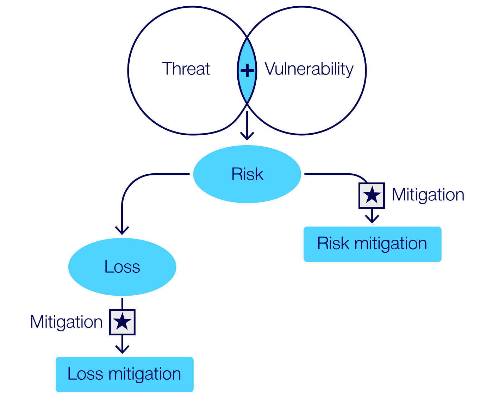
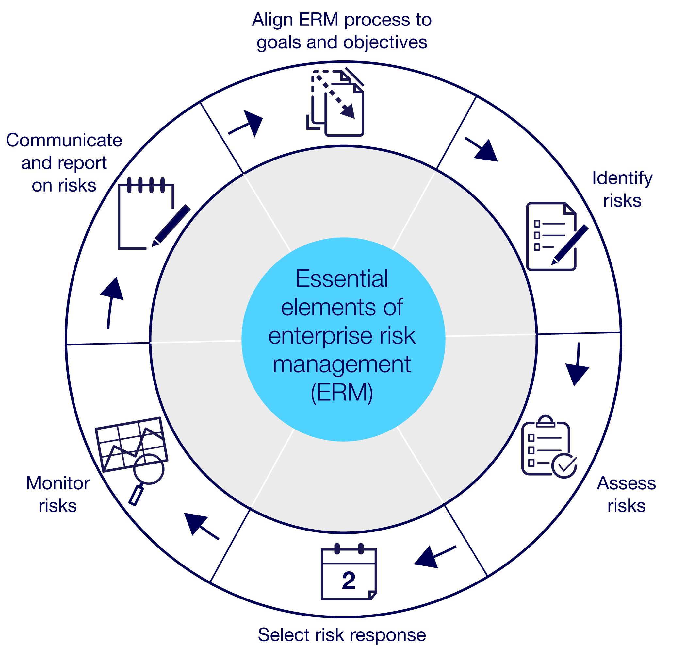
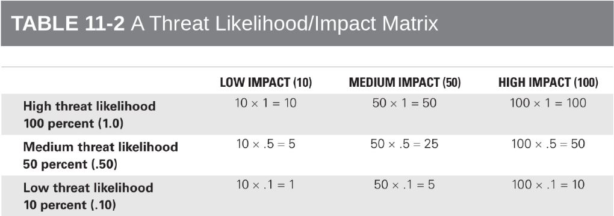
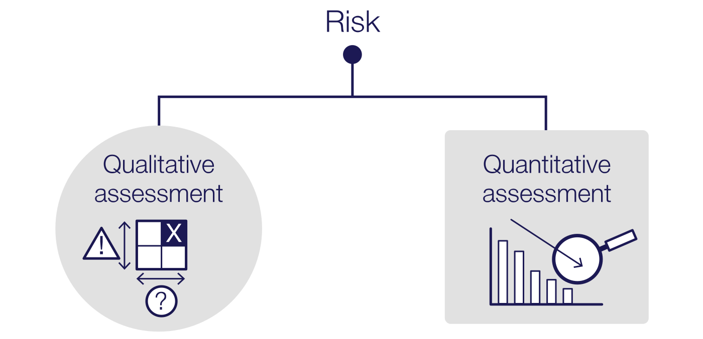
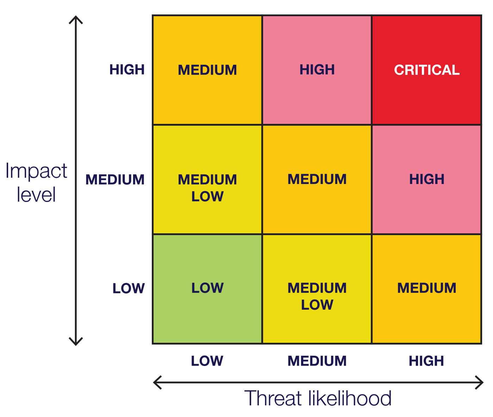

# INTE2665 | Week 9 | Cyber security risk management

## 9.0.0 Week overview: Cyber security risk management

Welcome to Week 9 of Introduction to Cyber Security

This week we’ll shift our focus to one of the most crucial aspects of cyber security:

cyber security risk management. Now that you have developed a strong foundation in network security, it’s
time to explore how to identify, assess and manage risks that can compromise the security of information
systems. This week you’ll learn to navigate the complexities of managing cyber risks by understanding
how threats, vulnerabilities and exploits interact and how they can be mitigated.

As the week progresses, you’ll delve into the process of performing a risk assessment, which includes
identifying assets, evaluating existing controls and determining countermeasures to enhance organisational
resilience. You’ll also learn best practices for planning risk mitigation across different levels of an
organisation, emphasising strategies to prioritise risk management requirements based on potential impact.

This week’s practical activity will involve hands-on exploration using advanced tools from Kali Linux.
You will apply theoretical knowledge in real-world scenarios, equipping you with skills to identify
and mitigate risks in diverse cyber environments.

## What you’ll learn this week

- Explain how to manage risks by addressing threats, vulnerabilities and exploits
- Describe the fundamental elements of an effective risk management plan
- Outline the steps involved in conducting a risk assessment
- Apply risk mitigation concepts across an organisation
- Use advanced tools from Kali Linux for risk analysis.

## Week 9 activities

- Read about risk, threats, vulnerabilities and exploits in cyber security
- Discuss public resources available for managing risks
- Engage in hands-on risk assessment using Kali Linux tools
- Participate in a case study on planning risk mitigation strategies.

Throughout this week, you will explore a range of excerpts from the following textbook:

Managing risk in information systems (Gibson and Igonor 2020).

Make sure you read through each relevant section that is specified by the associated page numbers.

### 9.1.0 Activity: Explaining methods of mitigating risk by managing threats, vulnerabilities and exploits

The goal of this activity is to help you understand the methods for mitigating risks within an IT
infrastructure by effectively managing threats, vulnerabilities and exploits. This activity will
demonstrate how identifying and prioritising vulnerabilities and threats can reduce overall risks
and improve security. By completing this activity, you will be able to assess potential risks and
apply appropriate mitigation techniques, thus directly supporting your assessment and strengthening
your skills in risk management. You’ll engage in tasks like identifying vulnerabilities, analysing
threats and implementing mitigation strategies, all of which are critical to ensuring IT infrastructure
safety and compliance.

#### 9.1.1 Risk, threats and vulnerabilities

##### How can you manage risks?

In this task you will explore the processes of identifying and managing risks by analysing threats,
vulnerabilities and potential exploits. You will gain insights into effective risk assessment and
mitigation strategies that are crucial for protecting IT systems and infrastructure.

> Note: Make sure you read only the selected sections of each book chapter in this task, outlined by
> the specified page ranges.

##### Read

1. **Managing risk** – This first reading introduces fundamental concepts of risk management, including
   the definitions of threats and vulnerabilities, and how these elements contribute to risk within an
   organisation. You’ll learn how threats exploit vulnerabilities to create risks and explore strategies
   to mitigate such risks effectively.

> > Chapter 2: Managing risk: threats, vulnerabilities, and exploits (pp. 81-98)

2. **Conducting a risk assessment** – The second reading guides you through the steps of conducting risk
   assessments, focusing on identifying, evaluating and prioritising risks, threats and vulnerabilities.
   This chapter emphasises methods for evaluating the severity of potential threats and the likelihood of
   exploits occurring.

> > Chapter 6: Performing a risk assessment (pp. 275-298)

3. **Performing a detailed threat and vulnerability analysis** – Your third reading deepens your
   understanding of how to perform a detailed threat and vulnerability analysis, including real-world
   case studies that illustrate how to identify and mitigate risks.

> > Chapter 8: Identifying and analyzing threats, vulnerabilities, and exploits (pp. 372-387)

##### REFLECT

Having completed your readings, think about the following:

- **Q:** Can you identify a real-world example where a specific threat exploited a vulnerability within an organisation? What were the consequences?

- **Q:** Have you ever been involved in a situation where you had to assess or manage risk? What approaches did you use, and what did you learn from the experience?

#### 9.1.2 Exploits

##### How are vulnerabilities exploited?

In this task you will explore how vulnerabilities in information systems can be exploited by attackers
and learn methods to identify, assess and mitigate these exploits. You will work through practical steps
for enhancing system security and reducing exploit risks.

##### Read

You will now continue with your readings from Task 9.1.1, focusing on how attackers use vulnerabilities
to gain unauthorised access or cause damage. By engaging with this reading you will learn about different
exploit types, real-world examples, and fundamental techniques to mitigate these risks.

Pay particular attention to Figure 2-2 on page 105, which outlines how public-facing servers, such as web
servers, are positioned within a demilitarized zone (DMZ) with two firewalls, explaining how they can be
exploited.

> > Chapter 2: Managing risk: threats, vulnerabilities, and exploits (pp. 105, 111-114)

##### Check your understanding

It’s now time to check your understanding of how public-facing servers can be exploited. For a public-facing
server in a DMZ, where should firewalls be positioned and where are the exploitation points located? Think
back to Figure 2-2 on page 105 of your reading.

Select the following Reveal feedback accordion to assess your response:

##### Reveal feedback

_The outer firewall separates the DMZ from the internet, where a black-hat hacker attempts to exploit
vulnerabilities. The inner firewall separates the DMZ from the internal network, which includes internal
clients and servers. This setup exemplifies how public servers are isolated to mitigate security risks
while highlighting potential exploitation points._

##### Read

It’s now time to continue on with **Chapter 8**, diving deeper into exploit analysis. This section
of the chapter covers exploit assessment methods, emphasising how to detect potential exploits within
an IT infrastructure. You will be guided through case studies and diagrams that illustrate how to map
vulnerabilities to specific exploit types.

> > Chapter 8: Identifying and analyzing threats, vulnerabilities, and exploits (pp. 404-414)

##### Check your understanding

Have a go at noting down how a TCP SYN flood attack occurs, where an attacker disrupts the handshake
process.

Select the following Reveal feedback accordion to assess your response:

##### Reveal feedback

_A host sends a SYN request to a server, initiating the first step of the handshake. The server responds
with a SYN/ACK message, waiting for the final acknowledgment from the host, which is not completed.
This partial handshake is repeated multiple times, demonstrating how the attack disrupts normal
communication by leaving the server in a waiting state._

##### 9.1.3 Public resources for risk management

##### How to support effective risk management

In this task you will explore how public resources, like NIST guidelines and ISO standards, support
effective risk management. You will learn to utilise these resources in risk assessment, planning
and mitigation.

##### Read

This reading discusses how public resources such as the NIST Risk Management Framework and ISO
27001 standards can be incorporated into risk management plans. It emphasises using these frameworks
for developing standardised, comprehensive risk management plans. As you read, pay particular
attention to diagrams that illustrate the integration of NIST and ISO guidelines in risk management
planning.

> > Chapter 4: Developing a risk management plan (pp. 181-228)

##### Affinity diagrams

As you will have read, affinity diagrams can help with generating lists of realistic threats,
vulnerabilities and recommendations in a risk management plan. An affinity diagram might look
like the following:

| Threats                   | Recommendations                      | Network Vulnerabilities    | Server Vulnerabilities    |
| ------------------------- | ------------------------------------ | -------------------------- | ------------------------- |
| Attackers                 | Upgrade firewall                     | Open ports on firewall     | No antivirus software     |
| Buffer overflow attackers | Manage firewall                      | No IDS                     | Operating system updates  |
| DoS, DDoS                 | Add network firewall                 | Loss of connectivity       | Unneeded services running |
| SYN flood attack          | Add host firewall                    | Unneeded protocols running |                           |
| Malware                   | Add intrusion detection system (IDS) | Hardware failure           |                           |
|                           | Add administrator                    | No backups                 |                           |

Source: Adapted from Figure 4-1: Affinity Diagram in Managing risk in information systems (Gibson 2022), page 196.

##### Read

Your next reading details how public resources can be used to translate risk assessments into actionable
mitigation strategies. It includes case studies demonstrating the use of resources like the MITRE ATT&CK
framework, which helps in identifying effective security controls based on public threat intelligence.

> > Chapter 11: Turning a risk assessment into a risk management plan (pp. 519-571)

#### 9.1.4 Use of threat/vulnerability pairs in managing risk

##### How do you use pairs to direct mitigation efforts?

In this task you will learn how to identify and use threat/vulnerability pairs to manage and mitigate
risks effectively within an IT infrastructure. You will work through practical examples of analysing
these pairs and applying risk reduction techniques.

##### Read

Revisit Chapter 2, which you have engaged with in Tasks 9.1.1 and 9.1.2, focusing on the concept of
threat/vulnerability pairs, and explanations of how threats can exploit specific vulnerabilities
to create risks. As you read through:

- Note down strategies for identifying these pairs and associated techniques for managing them
  effectively to minimise risk.
- Think about the organisation you work for (or have worked for in the past), what would be the
  most suitable strategies and techniques to minimise risk for that business’s situation?

> > Chapter 2: Managing risk: threats, vulnerabilities, and exploits (pp. 81-129)

The following diagram illustrates how threats exploit vulnerabilities, leading to potential losses.
It visualises the interaction of threats and vulnerabilities, which is crucial for understanding
how to manage risks effectively.

The flow of threat/vulnerability pairs. Source: RMIT Online, adapted from Gibson and Igonor (2020)

##### Read

Revisit Chapter 8, which you have engaged with in Tasks 9.1.1 and 9.1.2, focusing on deeper analysis
of threat/vulnerability pairs, and their role in risk assessment and prioritisation. Pay particular
attention to the case studies that show how organisations use these pairs to direct mitigation
efforts where they are most needed.

As you read through:

- Think about the business you work for (or have worked for in the past), do any of the case studies
  highlight how that organisation could successfully use pairs to direct mitigation efforts?

> > Chapter 8: Identifying and analyzing threats, vulnerabilities, and exploits (pp. 372-419)

### 9.2.0 Activity: Describe the components of an effective organisational risk management program

In this activity you will explore the essential components that form a robust and effective organisational
risk management program. Understanding these elements will equip you with the skills to create,
evaluate and refine risk management plans that address real-world organisational challenges.

By completing this activity you’ll gain insights into setting objectives, defining scope, assigning
responsibilities, and implementing actionable mitigation strategies that align with organisational goals.
This knowledge will directly support your ability to develop well-structured, strategic risk management
plans that can mitigate risks effectively.

The main task for this activity is to describe the critical components of a risk management program,
including planning, scheduling, documentation, and how these elements contribute to an organisation’s
overall resilience and operational success.

#### 9.2.1 Fundamental components and objectives of a risk management plan

##### What’s in a risk management plan?

In this task you will examine the fundamental components and key objectives of a risk management plan,
learning how to set effective, achievable goals to guide risk mitigation efforts. You will define the
primary elements that create a structured approach to managing organisational risk.

##### Read

For this task you will revisit a reading you first looked at in Task 9.1.3. The reading introduces
the foundational components of a risk management plan, covering objectives like identifying risks,
defining risk tolerance, and aligning mitigation strategies with organisational goals. You’ll read
about how a well-defined risk management plan helps in reducing potential losses and enhancing
resilience.

> > Chapter 4: Developing a risk management plan (pp. 181-228)

##### Another approach to risk management

There are a range of approaches to the development of risk management plans.

Take a look at the following diagram that outlines the essential elements of enterprise risk management
(ERM). Select the plus icon hotspots to learn more about each component.

- **ERM Goals and objectives** => Ensure the ERM process maximises the achievement of agency mission and
  results.
- **Identify Risk** => Assemble a comprehensive list of risks both threats and opportunities that could
  affect the agency from achieving its goals and objectives.
- **Assess Risk** => Examine risks considering both the likelihood of the risk and the impact of the
  risk on the agency mission.
- **Select RRisk Response** => Select the response (based on risk appetite) acceptance, avoidance,
  reduction, share/transfer, or maximise opportunity.
- **Monitor Risk** => Monitor how risks are changing and if responses are successful.
- **Communicate and report risks** => Communicate risks to stakeholders and report on the status of
  addressing the risk.

Essential elements of enterprise risk management (ERM). Source: RMIT Online, adapted from Muller and
Thomas (2022)

##### Reflect

Having explored both risk management approaches, spend some time thinking about the advantages and
disadvantages of both. Is there one that would suit implementation in the organisation you work for?
Why or why not?

##### 9.2.2 Boundaries and scope of a risk management plan

##### What’s the scope?

In this task you will explore how to define the boundaries and scope of a risk management plan, focusing
on identifying what areas of the organisation and its assets will be covered. This helps in ensuring
clarity and effectiveness in managing risks across various departments and functions.

The chapter you read in Task 9.2.1 offers guidance on setting boundaries and defining the scope for a
risk management plan, which is essential to specify the areas, resources and assets included in risk
management efforts.

##### How the scope supports the plan

Revisit the chapter, focusing on the sections that explore how defining the scope supports efficient
allocation of resources and tailored mitigation strategies.

> > Chapter 4: Developing a risk management plan (pp. 181-228)

##### Scope example

Take a look at an example of an outlined scope from a health case study. This example outlines the
scope for HIPAA compliance, demonstrating how to define boundaries within a risk management plan.

##### HIPAA compliance

The purpose of this risk management plan is to ensure compliance with HIPAA for Mini Acme’s data.
The scope of the plan includes:

- identifying all health data
- storing health data
- using health data
- transmitting health data.

Stakeholders for this project include:

- CIO
- human resources (HR) department head.

Written approval is required for all activities outside of the scope of this plan.

##### Develop a scope

You will now read through a quick fictional case study, and have a go at developing a scope similar
to the HIPAA compliance one you have just viewed.

##### Case study

**Background:**

MetroHealth is a regional healthcare provider seeking to enhance its data security framework to comply
with new regulations regarding patient data protection. The organisation has decided to develop a
comprehensive risk management plan to address these requirements.

**Current situation:**

MetroHealth has identified potential risks related to its electronic health records (EHR) system,
including unauthorised data access, data breaches, and insufficient staff training on handling
sensitive information. The organisation aims to ensure data integrity, availability and confidentiality,
thereby safeguarding patient trust.

**Objective:**

To outline a risk management plan focusing on securing electronic patient data and achieving compliance
with the latest data protection standards.

**Key personnel:**

IT Security Manager, Data Protection Officer

Spend a few minutes putting together a quick scope, formatted similarly to the example you looked at
above. Once completed, select the reveal feedback accordion to assess your scope.

##### Reveal feedback

**Risk management plan: data security for MetroHealth**

**Purpose:** Enhance data security and comply with patient data protection regulations.

**Scope:**

- securing electronic health records (EHR)
- preventing unauthorised data access
- mitigating data breach risks
- enhancing staff training on data privacy.

**Stakeholders:**

- IT Security Manager
- Data Protection Officer

Note: Written approval is required for any actions outside this plan’s scope.

#### 9.2.3 Importance of assigning responsibilities in a risk management plan

##### Who is responsible?

In this task you will discuss with your peers why assigning responsibilities is crucial for the success
of a risk management plan. You’ll think about how clear role assignments ensure accountability and
enhance the effectiveness of risk mitigation efforts across an organisation.

##### Discuss

Chapter 4: Developing a risk management plan, which you have looked at for both Task 9.2.1 and 9.2.2
discusses the importance of defining and assigning responsibilities within a risk management plan,
focusing on how this contributes to accountability, timely action and the seamless implementation
of risk strategies.

**Step 1:** Spend some time noting down how defining and assigning responsibilities within a risk
management plan contributes to either, accountability, timely action or the seamless implementation
of risk strategies.

**Step 2:** Post your work to the discussion board, outlining whether you focused on accountability,
timely action or the seamless implementation of risk strategies.

**Step 3:** Read at least two posts by your peers, and comment with anything that you think could be
an additional contribution.

#### 9.2.4 Significance of planning, scheduling, and documentation

##### Ensuring risk mitigation

In this task you will explore the essential role of planning, scheduling and documentation within a
risk management plan. Through this activity, you will analyse how these elements contribute to the
successful mitigation of risks by ensuring structured and timely responses, clear assignment of
responsibilities and traceability of actions.

Effective risk management in network security requires meticulous planning, consistent scheduling
and comprehensive documentation. Each element supports the framework of a risk management plan,
ensuring that responses are coordinated, timely and aligned with organisational goals.

You are encouraged to review the discussion from Chapter 4: Developing a risk management plan, on
structured risk mitigation frameworks, focusing on strategies that emphasise well-documented plans,
such as the sequence for establishing mitigation timelines and checklists.

##### REFLECT

As you examine three key steps to the development of a risk management plan, reflect on how easily
each step could be implemented in the organisation you work for (or have worked for in the past).
Are there any barriers to implementation? Why or why not?

**Planning:**

Identify key steps in developing a risk management plan. Consider the importance of early-stage
planning, especially in setting clear objectives, resource allocation, and defining potential risk
scenarios.

**Scheduling:**

Examine methods for creating a feasible and efficient timeline for implementing risk mitigation
actions. This may include regular audits, periodic evaluations, and predefined response schedules
to ensure proactive risk management.

**Documentation:**

Documentation provides accountability and a reference for revising plans. Reflect on documentation’s
role in maintaining transparent records of actions, assessments and updates within a risk management
framework. You should consider how well-documented plans contribute to compliance and improvement
in future risk management efforts.

### 9.3.0 Activity: Planning risk mitigation throughout an organisation

Throughout this activity you will revisit the key factors and components of a risk management plan you
have explored this week, engaging with the essential concepts and strategies for planning risk mitigation
across an organisation.

You will examine how an organisation-wide approach to risk management can enhance resilience, protect
assets and maintain business continuity in the face of threats.

#### 9.3.1 Identifying the scope of a risk management plan

##### What are the essential steps?

In this task you will explore the essential steps in conducting a thorough risk assessment. You will
learn how to evaluate potential threats and vulnerabilities systematically, supporting the development
of effective mitigation strategies.

The primary steps of risk assessment. Source: RMIT Online

1. **Define the scope**

   You should begin by outlining the boundaries of the risk assessment. This involves specifying the
   systems, assets and processes under review to ensure focused and manageable assessment efforts.
   You may like to revisit Task 9.2.2 Boundaries and scope of a risk management plan, before examining
   the following reading for how to define the scope within a risk management plan.

   > > Chapter 4: Developing a risk management plan (pp. 181-190)

2. **Identify threats and vulnerabilities**

   The next step is to identify and review potential threats, including both external and internal
   sources, and assess vulnerabilities within the systems. Consider environmental, technological and
   human-related risks that could impact assets.

   Read through the following for techniques on identifying threats and vulnerabilities effectively.

   > > Chapter 5: Defining risk assessment approaches (pp. 240-250)

3. **Assess impact and likelihood**

   Your third step is to evaluate the possible consequences if threats exploit vulnerabilities and
   the probability of such events occurring. This analysis helps you prioritise risks based on their
   potential effect on the organisation.

   Refer to the following reading for guidance on impact and likelihood assessments.

   > > Chapter 5: Defining risk assessment approaches (pp. 251-260)

4. **Develop mitigation recommendations**

   Your last step is to, based on your findings, create actionable recommendations to address high-priority
   risks. Mitigation strategies can include implementing new security controls, updating protocols or
   enhancing training programs.

   Resources on best practices for risk mitigation are available in the following reading.

   > > Chapter 5: Defining risk assessment approaches (pp. 261-273)

#### 9.3.2 Best practices for risk planning risk mitigation

##### Supporting risk management goals

In this task you will learn about best practices for planning risk mitigation across an organisation.
You will explore effective methods to enhance organisational resilience and support long-term risk
management goals.

1. **Review historical risk data and compliance requirements**

   Successful risk planning begins with examining past risk data and aligning with legal and compliance
   mandates. By reviewing historical incidents and existing risk assessment reports, you can identify
   recurring vulnerabilities and understand regulatory impacts on mitigation strategies.

   Additional reading

   Refer to the following chapter for a comprehensive guide on leveraging historical data and compliance
   laws:

   > > Chapter 10: Planning risk mitigation throughout an organization

2. **Conducting cost-benefit analysis**

   One critical practice in risk mitigation planning is performing a cost-benefit analysis (CBA) to
   justify security controls. This analysis helps prioritise which risks to address based on budget,
   impact and organisational priorities.

   Additional reading

   Refer to the following chapter for techniques and examples of CBA in risk planning:

   > > Chapter 11: Turning a risk assessment into a risk mitigation plan

3. **Prioritising and implementing countermeasures**

   Establishing a priority system for countermeasures is essential for managing high-risk areas
   efficiently. A ranking system should be based on risk severity and potential impact, allowing for
   a structured implementation of controls. Access the following reading for a framework on prioritising
   countermeasures and ensuring follow-up measures are in place:

   > > Chapter 11: Turning a risk assessment into a risk mitigation plan (pp. 545-549)

4. **Using a threat likelihood and impact matrix**

   A threat likelihood and impact matrix can visually support prioritisation by categorising risks
   based on likelihood and impact levels. Take a look at the following image for an example of what
   a threat likelihood/impact matrix table might look like.

#### 9.3.3 Ways to prioritise risk management

##### Ranking risks

In this task you will learn effective techniques to prioritise risk management requirements. You will
explore methods to rank risks by severity and potential impact, aiding in the allocation of resources
to address the most critical threats first.

##### Understanding quantitative and qualitative risk assessment

You can utilise both quantitative and qualitative methods to conduct risk assessments.

**Quantitative methods:**

Quantitative methods involve numerical evaluations, such as potential financial loss.

**Qualitative methods:**

Qualitative methods focus on categorising risks by likelihood and impact severity.

##### READ

Refer to the following reading to understand the key differences between qualitative and quantitative
methods and how they apply to prioritisation.

> > Chapter 5: Defining risk assessment approaches (pp. 240-25)

##### Using a threat likelihood and impact matrix

A valuable tool for risk prioritisation, a threat likelihood and impact matrix helps visualise which
risks require immediate attention. This matrix assesses risks based on their likelihood and potential
impact, allowing organisations to focus on high-priority areas.

You examined a threat likelihood and impact matrix in the last task. You may like to refer to the
following section from this week’s textbook to learn more:

> > Using a threat likelihood/impact matrix (p. 545)

Look at the following diagram to see an alternative way of presenting these matrixes.

##### Cost-benefit analysis (CBA) for risk prioritisation

A cost-benefit analysis (CBA) should be incorporated into risk prioritisation in order to effectively
evaluate the financial implications of mitigating specific risks. By comparing the cost of potential
mitigation strategies against the expected benefit, you will be better equipped to prioritise which
risks justify resource allocation.

Consult the following reading for examples of CBA in prioritising risk elements:

> > Performing a cost-benefit analysis on the identified risk elements (pp. 551-554)

Week 9 - Activity 4: Applying advanced tools from Kali Linux

Approx. 2 hours 10 minutes to complete all tasks in this activity
In this activity you’ll be introduced to a variety of advanced tools in Kali Linux. You’ll practise using these tools and reflect on this. Although you won’t be assessed on your skills in this area, these tools can help in analysing network traffic and determining vulnerabilities in cyber systems.

#### 9.4.0 Activity: Applying advanced tools from Kali Linux

In this activity you’ll be introduced to a variety of advanced tools in Kali Linux. You’ll practise
using these tools and reflect on this. Although you won’t be assessed on your skills in this area,
these tools can help in analysing network traffic and determining vulnerabilities in cyber systems.

#### 9.4.1 Task 1: Practise advanced tools

##### Practising using advanced tools in Kali Linux

In this task you’ll be introduced to advanced tools in Kali Linux. This will help broaden your
understanding of these useful tools.

##### Introduction to security tools in Kali Linux

In addition to the specific tools taught in this course so far, Kali Linux also has a range of
penetration testing tools covering various areas in security and forensics.

##### Practice

Go to the Lab manual and navigate to Week 9-10: Selected security tools in Kali Linux. Over
this week, select from the following tools to practise with:

- John the ripper
- Hydra
- Maltego
- Nmap
- Zed Attack Proxy
- sqlmap
- Metasploit Framework
- Burp Suite.

#### 9.4.2 Task 2: Reflect on using advanced tools

##### Assessing your progress

In this task you’ll reflect on your time practising using advanced security tools. This will
help you to consolidate your understanding of these helpful tools and extend your abilities.

##### REFLECT

Consider your work using advanced tools this week. Write a reflection in your journal considering
the following:

- Reflect on the ethics of using these tools and constructive work.
- Research and review ethical practices in using these tools.
- Which tools do you feel most confident using?
- In which areas could you improve?

### 9.5.0 Activity: Preparing for Assessment 3

In this activity you’ll take a short quiz on the content of Week 9. This will support your
preparation for Assessment 3.

#### 9.5.1 Prepare for Assessment 3

Details for Assessment 3 (online quiz):

- Points = 5
- Questions = 5
- No time limit

The following where the practice exam questions for Week-9 content, Cyber Security Risk Management.

Question 1:

A ******\_______****** policy governs how patches are understood, tested and rolled out to systems 
and clients.

- Patch management (ANS)
- Patch mitigation
- Version control
- Configuration management

Question 2:

POAM stands for:

- Processes of accountable management
- Plan of accurate mitigation
- Procedures of accident management
- Plan of action and milestones (ANS)
- Program of action and metrics

Question 3:

What is the purpose of a plan of action and milestones (POAM)?

- Assigns risk response procedures to stakeholders.
- Creates deadlines for risk response.
- Tracks risk response actions. (ANS)
- Identifies vulnerabilities.
- Establishes risk ownership hierarchy.

Question 4:

Jiang has been working on a risk management plan for his government agency. What information should
he include in the report to management when he presents his risk management recommendations?

- Findings, recommendation cost and time frame and cost-benefit analysis (CBA). (ANS)
- Recommendation, justification and procedures.
- Affinity diagrams, plan of action and milestones (POAM) and CBA.
- A list of stakeholders, affinity diagrams and procedures.

Question 5:

How do you start a risk assessment?

- By identifying countermeasures.
- By defining controls.
- By defining what you will assess. (ANS)
- By mitigating risks.
- By assigning risk owners.

---

END OF WEEK 9 MODULE -> MOVE ON TO LAB WORKSHOPS WEEK 9-10